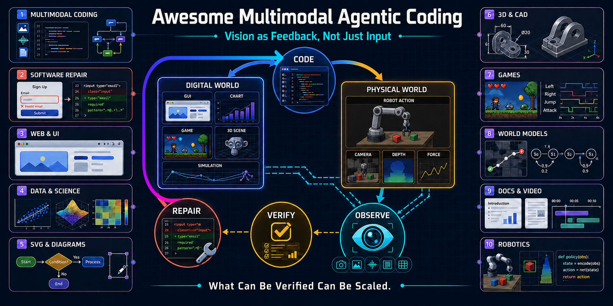
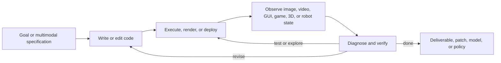

<div align="center">



<br>

***What Can Be Verified Can Be Scaled.***

**Agents that see what they build, interact with what they build, and iteratively improve it.**

[](https://awesome.re)
[](./LICENSE)
[](#contributing)
[](#contact-and-collaboration)
[](#paper-and-project-list)

[](./README.md)
[](./README.zh-CN.md)

**Last updated: 2026-09-06**

</div>

## 🔥 News

- **[2026-09-06]** Released **v0.1.0**, the first public version of Awesome Multimodal Agentic Coding, with 111 core works across ten task areas, practical skills and execution-engine maps, selected cases, and bilingual documentation.

<a id="motivation"></a>
## 💡 Motivation

Multimodal coding has traditionally meant **using an image, video, chart, or design as the initial input to code generation**. This repository focuses on a narrower transition:

> **Traditional multimodal coding uses vision as input. Multimodal agentic coding uses multimodal perception as feedback.**

> ***We believe multimodal agentic coding is a new multimodal paradigm: vision is no longer only an input modality for understanding a task—it becomes a recurrent control signal for acting, verifying, and improving inside the coding loop.***

The object of study is not merely `multimodal input → code`, but an autonomous or semi-autonomous trajectory in which executable code produces a visual or interactive state, the agent observes that state, and the observation redirects later work.

In this paradigm, an agent does not merely **see before coding**. It **sees while coding**, decides when another observation is needed, and uses what it perceives to choose what to do next.



<a id="definition-and-scope"></a>
## 📌 Definition and Scope

We use **multimodal agentic coding** to mean systems in which the following four events occur in the **same agent trajectory**:

1. the agent generates or modifies executable code or another programmatic representation;
2. that code creates or changes an executable or editable artifact—or an executable world state;
3. the agent receives a post-execution visual, temporal, spatial, interactive, or embodied observation; and
4. that observation changes a later code or tool action.

Here, an **artifact** is a product or state built through code: for example a web page, UI, chart, SVG, CAD model, 3D scene, game, document, video, simulator, digital twin, or robot policy.

The central inclusion test is:

> **Can we trace code → executable artifact → post-execution multimodal evidence → a later code/tool action within one trajectory?**

A benchmark may instantiate this loop through a named track, baseline, or documented agent configuration, even when other evaluated settings do not use multimodal feedback.

### What is included

- Iterative generation and repair of web pages, apps, charts, diagrams, 3D scenes, CAD models, games, slides, posters, animations, and videos.
- Repository-level visual issue reproduction, localization, patching, and regression validation.
- Coding agents that actively browse, inspect screenshots, sample video frames, operate GUIs, play games, or observe robots while modifying code.
- Agent-authored executable world models and digital twins whose code is revised from multimodal observations or interaction counterexamples.
- Training methods, datasets, and benchmarks specifically built around these loops.

<a id="perspectives"></a>
## ✍️ Perspectives, Blogs, and Industry Signals

This section collects attributed, non-peer-reviewed signals that help explain why multimodal feedback is moving into the coding loop, complementing the research literature with practitioner evidence.

- `2026-08-02` **Andrej Karpathy — Long-horizon Three.js experiment and commentary.** [[X]](https://x.com/karpathy/status/2083749667410727319?s=20) — **Direct inspiration for this repository.**
  > *Topic signal:* Large visual programs are becoming inexpensive to generate, while efficiently watching, playing, auditing, and repairing them remains a central bottleneck.

- `2026-09-05` **Z.ai / AutoClaw Team — GLM-5.3-Flash: More Intelligence with Less Compute.** [[official blog]](https://autoclaw.z.ai/blog/model/glm-5.3-flash/) [[model card]](https://huggingface.co/zai-org/GLM-5.3-Flash)
  > “Vision therefore becomes part of execution and verification rather than a separate input capability.”
  >
  > *Topic link:* The model is explicitly framed around inspecting rendered work, determining what should happen next, and continuing refinement across documents, interfaces, and other visual artifacts.

- `2026-09-03` **OpenAI — GPT-6 Astra and the Playco game-prototyping case.** [[official launch]](https://openai.com/index/gpt-6-astra/) [[Playco case]](https://openai.com/index/playco-game-prototyping-with-astra/) [[model guide]](https://developers.openai.com/api/docs/models/gpt-6-astra)
  > Astra can “create a website, and run frontend QA checks to make sure all the features on that site work.”
  >
  > *Topic link:* The launch highlights visual judgment over websites, games, applications, and renderings; the Playco case makes the loop concrete through scene edits, gameplay tests, validation, bug finding, and further improvement in Unity and Godot.

- `2026-02-24` **Cursor — Cursor agents can now control their own computers.** [[official blog]](https://cursor.com/blog/agent-computer-use) [[browser docs]](https://cursor.com/docs/agent/tools/browser)
  > Agents can “build and interact with software directly ... iterate until they’ve validated their output.”
  >
  > *Topic link:* Screenshots, videos, interaction traces, console output, and network evidence can all close the loop between a code change and its validation.

- `2025-09-15` **OpenAI — Introducing upgrades to Codex.** [[official blog]](https://openai.com/index/introducing-upgrades-to-codex/)
  > Codex can “spin up its own browser, look at what it built, iterate.”
  >
  > *Topic link:* Browser observation becomes part of autonomous implementation and verification rather than a final human-only review step.

- `2025-07-24` **Anthropic — How Anthropic teams use Claude Code.** [[official blog]](https://claude.com/blog/how-anthropic-teams-use-claude-code)
  > Teams set up “autonomous loops where Claude Code writes the code, runs tests, and iterates continuously.”
  >
  > *Topic link:* Figma inputs, dashboard screenshots, executable prototypes, and repeated testing show how visual context is entering real coding workflows, while still leaving room for stronger autonomous visual verification.

<a id="skills-and-tool-bridges"></a>
## 🧰 Practical Agent Skills and Tool Bridges

Papers describe methods; skills and tool bridges make those methods operable in real environments. We use **skill** for reusable procedural knowledge—typically instructions plus optional scripts, references, and assets—and distinguish it from the CLI, MCP server, API, or plugin that exposes actions and observations.

> **Operational stack:** `Agent Skill → CLI / MCP / API → Engine or Runtime → Render / Execute → Observe → Revise`

The list below is a practical starting point rather than a security audit or endorsement. Each resource supports an artifact-code loop through artifact-specific execution or observation. **Official** denotes a resource maintained by the underlying platform or project; **Community** integrations should be inspected and sandboxed before use.

| Capability | Resource | Form and provenance | Why it matters for the closed loop |
|---|---|---|---|
| Browser building and testing | [Playwright MCP](https://github.com/microsoft/playwright-mcp) · [Chrome DevTools MCP](https://github.com/ChromeDevTools/chrome-devtools-mcp) | Official MCP / CLI + skills | Exposes accessibility structure, screenshots, interaction, console and network evidence, and performance traces. |
| Design-to-code and design write-back | [Figma MCP server](https://developers.figma.com/docs/figma-mcp-server/) | Official MCP + skills | Lets an agent inspect design context, generate implementation code, and create or update native Figma content. |
| Text/image-to-CAD workflows | [text-to-cad](https://github.com/earthtojake/text-to-cad) | Community skill library | Covers CAD generation and editing, browser preview, STEP/DXF/robot formats, manufacturability checks, slicing, and handoff—not only one-shot geometry generation. |
| Parametric CAD execution | [CadQuery MCP server](https://github.com/CadQuery/cadquery-contrib/tree/master/mcp-server) | Project-hosted MCP | Executes CadQuery, renders multiple SVG views, inspects topology and physical properties, and exports manufacturing formats. |
| Hosted CAD agents and geometry APIs | [Zoo developer tools](https://docs.zoo.dev/docs) | Official MCP / Agent API / Engine API | Connects language-driven KCL workflows to geometric execution, snapshots, inspection, and debugging. |
| Blender and procedural 3D | [Blender Lab MCP Server](https://www.blender.org/lab/mcp-server/) · [BlenderMCP community demos](https://github.com/ahujasid/blender-mcp) | Official MCP + community demo ecosystem | Gives agents scene inspection and Python operations inside Blender; community demos show reference-image-to-scene and Blender-to-Three.js workflows. |
| Three.js and browser 3D | [threejs-skills](https://github.com/full-stack-skills/threejs-skills) · [threejs-game-skills](https://github.com/majidmanzarpour/threejs-game-skills) | Community skills | Encodes scene, camera, material, animation, gameplay, deterministic testing, and visual-regression workflows. |
| Multi-engine game construction and visual QA | [3AGameFactory](https://github.com/OpenDCAI/GameFactory-3A) | Project-hosted skills + pipelines + engine adapters | Routes coding agents across asset, gameplay, and UI generation for UE5, Unity, Godot, Blender, and Three.js, then requires rendered asset review, in-engine capture, and repair before acceptance. |
| p5.js visual creation and review | [ALIGN](https://github.com/wanshuiyin/ALIGN-Agentic-Loop-Image-GeneratioN) | Community skills + reproducible demos | Packages reference-art and method-figure workflows for Codex and Claude Code: write p5.js, render, obtain an independent pixel-grounded review, revise the program, and retain the decisions and versions. |
| Unity development | [Unity Agent Skills](https://github.com/Unity-Technologies/skills) | Official skills + CLI | Covers project setup, packages, UI, shaders, validation, and repeatable editor/build operations. |
| Godot development | [Godot MCP](https://github.com/hybridindie/godot-mcp) | Community MCP | Supports scenes and scripts, running projects, input driving, screenshots, replays, profiling, and export. |
| Unreal development | [Unreal MCP](https://github.com/ZiggyMar/unreal-mcp) | Community MCP | Provides indexed, token-efficient inspection and editing of Unreal projects and Blueprints. |
| Diagram-as-code | [Mermaid MCP server](https://mermaid.ai/docs/ai/mcp-server) | Official MCP | Validates diagram syntax and returns SVG/PNG renders that can be inspected and repaired. |
| Programmatic video | [Remotion](https://github.com/remotion-dev/remotion) | Official framework + skills | Turns React code into inspectable frames and videos, enabling frame-level rendering and iterative correction. |
| Mathematical animation | [Manim MCP](https://github.com/paulnegz/manim-mcp) | Community MCP | Connects text, generated Manim code, rendered video, and subsequent correction in one workflow. |

> **Safety note:** many of these integrations can execute code inside browsers, CAD systems, DCC tools, and game engines. Review the source, pin versions, restrict filesystem and network access, and use isolated project copies when evaluating community bridges.

<a id="execution-and-rendering-engines"></a>
## ⚙️ Execution and Rendering Engine Map

The engine is not merely an output target: it determines what the agent can execute, what it can observe, and how cheaply it can verify a change. A useful default is to choose the **lowest-complexity engine that can express the artifact and expose reliable observations**.

> `HTML/CSS → SVG/Canvas → Three.js/Babylon.js → Blender or CAD → Godot/Unity/Unreal → Robotics simulators`

| Layer | Common engines and runtimes | Typical code surface | Agent-visible feedback |
|---|---|---|---|
| Browser baseline | [HTML](https://developer.mozilla.org/en-US/docs/Web/HTML) / [CSS](https://developer.mozilla.org/en-US/docs/Web/CSS) / JavaScript · [SVG](https://developer.mozilla.org/en-US/docs/Web/SVG) · [Canvas](https://developer.mozilla.org/en-US/docs/Web/API/Canvas_API) · [WebGL](https://developer.mozilla.org/en-US/docs/Web/API/WebGL_API) / [WebGPU](https://developer.mozilla.org/en-US/docs/Web/API/WebGPU_API) | Markup, styles, DOM, vector paths, shaders | DOM/accessibility tree, screenshots, events, console/network logs, pixels |
| Browser 2D and games | [PixiJS](https://pixijs.com/) · [Phaser](https://phaser.io/) | JavaScript/TypeScript scenes and game logic | Frames, pointer/keyboard behavior, collisions, timing, performance |
| Web 3D | [Three.js](https://threejs.org/docs/) · [Babylon.js](https://doc.babylonjs.com/) · [React Three Fiber](https://r3f.docs.pmnd.rs/getting-started/introduction) | JavaScript/TypeScript scene graphs and shaders | Multi-view screenshots, cameras, object transforms, scene state, GPU diagnostics |
| Data visualization | [D3](https://d3js.org/) · [Vega-Lite](https://vega.github.io/vega-lite/) · [Plotly.js](https://plotly.com/javascript/) | Declarative specs or JavaScript | SVG/Canvas renders, data/scale/legend checks, hover and interaction state |
| Diagrams and documents | [Mermaid](https://mermaid.js.org/) · [Graphviz](https://graphviz.org/documentation/) · [PlantUML](https://plantuml.com/) · [Typst](https://typst.app/docs/) · [TikZ](https://tikz.dev/) | Textual diagram or page-description languages | Parser/compiler errors, SVG/PNG/PDF renders, layout and page geometry |
| CAD and geometry | [OpenSCAD](https://openscad.org/documentation.html) · [CadQuery](https://cadquery.readthedocs.io/en/latest/) · [build123d](https://build123d.readthedocs.io/en/latest/) · [FreeCAD](https://wiki.freecad.org/Power_users_hub) · [Zoo/KCL](https://zoo.dev/docs/kcl) | Parametric scripts, feature trees, constraints, B-Rep/mesh operations | Geometry validity, topology, bounds/volume, multi-view renders, STEP/STL export |
| DCC and procedural 3D | [Blender Python API](https://docs.blender.org/api/current/) | Python, geometry nodes, scene and material graphs | Scene graph, object/material statistics, stills, multi-view renders, animation |
| Game engines | [Godot](https://docs.godotengine.org/en/stable/) · [Unity](https://docs.unity3d.com/Manual/index.html) · [Unreal Engine](https://dev.epicgames.com/documentation/en-us/unreal-engine) | Engine scripts, scenes, prefabs/nodes, shaders, Blueprints/C++ | Build/test logs, screenshots, input traces, replays, physics and runtime state |
| Animation and video | [Manim](https://docs.manim.community/) · [Remotion](https://www.remotion.dev/docs/) · [FFmpeg](https://ffmpeg.org/documentation.html) | Python, React/TypeScript, media pipelines | Frames, video, timing, duration/audio checks, render and encoding errors |
| Robotics and simulation | [MuJoCo](https://mujoco.readthedocs.io/en/stable/overview.html) · [Isaac Sim](https://docs.isaacsim.omniverse.nvidia.com/latest/index.html) · [Gazebo](https://gazebosim.org/docs/latest/getstarted/) · [PyBullet](https://github.com/bulletphysics/bullet3) | Robot models, controllers, policies, simulation scripts | Sensor/state streams, contacts, trajectories, rollout video, task outcomes |

These layers are complementary rather than mutually exclusive. For example, an agent may edit a CadQuery model, inspect it in a browser viewer, render polished views in Blender, and validate assembly behavior in a simulator. We therefore track both the **artifact engine** and the **observation channel** when evaluating a system.

<a id="selected-cases-and-demos"></a>
## 🎬 Selected Cases and Demos

The following examples make the coding loop concrete across different tasks. We prioritize author or official sources and label the strength of the evidence: a case may be useful as an **industry proof-of-concept**, **community demo**, or **adjacent creation signal** without qualifying as a core closed-loop research work.

| Task | Case and source | What to watch | Evidence label |
|---|---|---|---|
| Visual software engineering | **Programming with Pixels** — Aggarwal & Welleck [[project + demo]](https://programmingwithpixels.com/) | A computer-use agent sees VS Code, types and clicks, edits UI code, and inspects the live preview instead of relying only on text tools. | Closed-loop research demo |
| Web and UI reconstruction | **WebVIA** — Zhen et al. [[project + cases]](https://zheny2751-dotcom.github.io/webvia.github.io/) | The agent explores multi-state source pages, builds executable HTML/CSS/JS, then tests clicks, input, and navigation against the observed behavior. | Closed-loop research demo |
| Native design systems | **Agents, meet the Figma canvas** — Figma [[official blog + demos]](https://www.figma.com/blog/the-figma-canvas-is-now-open-to-agents/) | Coding agents create or edit native Figma layers with real components and variables, take screenshots, and iterate through a documented self-healing loop. | Official product workflow |
| Data visualization | **VisCoder2** — TIGER AI Lab [[project + case studies]](https://tiger-ai-lab.github.io/VisCoder2/) | Examples span Python, Vega-Lite, Mermaid, SVG, LaTeX, and other languages, including successful execution recovery and failed visual-repair attempts. | Closed-loop research demo |
| Programmatic image and method-figure creation | **ALIGN** — wanshuiyin [[repo + interactive gallery]](https://github.com/wanshuiyin/ALIGN-Agentic-Loop-Image-GeneratioN) | Coding agents construct images as editable p5.js programs; independent reviewers inspect rendered pixels and their critiques drive later code revisions across documented multi-round histories. | Closed-loop community demo |
| Raster to editable graphics | **DrawAI Workbench** — Renaissance Mind [[repo + demo]](https://github.com/Renaissance-Mind/DrawAI) | Raster figures, slides, and diagrams become editable SVG/PPTX artifacts; the workbench exposes intermediate outputs and validation rather than only a final image. | Closed-loop research demo |
| CAD from text, sketches, and scans | **CAD-Assistant** — Mallis et al. [[project + video]](https://cadassistant.github.io/) | The agent writes and executes FreeCAD actions, observes the evolving model, and adapts later code to hand-drawn commands or 3D scan evidence. | Closed-loop research demo |
| CAD to physical simulation | **Onshape × NVIDIA Isaac Sim** — Onshape by PTC (@Onshape) [[official X]](https://x.com/Onshape/status/2061440183564709951) | A multi-agent proof-of-concept carries CAD geometry into simulation and automatically handles geometry, physics, and materials. | Industry proof-of-concept |
| Procedural 3D | **3DCodeBench** — 3DCodeBench team [[interactive gallery]](https://www.3dcodebench.com/) | Agents execute Blender programs, read errors, retry, refine across turns, and visually critique procedural objects; the site includes draggable 3D examples. | Closed-loop research demo |
| Blender scene creation | **Blender MCP examples** — Blender Lab & BlenderMCP community [[official MCP]](https://www.blender.org/lab/mcp-server/) [[community demos]](https://github.com/ahujasid/blender-mcp) | Demonstrations include reference-image-to-Blender-scene and scene-inspection-to-Three.js workflows with viewport or rendered evidence. | Official tool + community demos |
| Continual game generation | **Play2Code gallery** — GUI Agents for Continual Game Generation [[playable demos]](https://continual-game-generation.vercel.app/) | A GUI agent plays generated browser games and returns experience traces to a coding agent, which continues modifying the game. | Closed-loop research demo |
| Game-engine coding and self-validation | **GPT-6 Astra × Playco Playbot** — OpenAI & Playco [[official case]](https://openai.com/index/playco-game-prototyping-with-astra/) | Playbot connects Unity and Godot; Astra edits scenes, plays and tests the game, validates changes, finds bugs, and improves the playable artifact. OpenAI reports a customer-observed 50% reduction in manual fixes. | Official product case |
| Game porting and GPU repair | **Speedrun your game port with agentic coding** — Apple [[WWDC26 video + transcript]](https://developer.apple.com/videos/play/wwdc2026/357/) | The agent ports MiniEngine, captures and inspects GPU traces, fixes visibly incorrect lighting and textures, and validates the corrected render against reference captures. | Official engineering workflow |
| Executable world models | **TWIN interactive replay** — TWIN team [[project + replay]](https://arc-agi-3-twin.vercel.app/) | The agent writes a Python twin of an unknown game, validates transitions against interaction history, repairs the first mismatch, and plans inside the revised model. | Closed-loop research demo |
| Multi-format design | **AutoDesign Open Research Demo** — Luo et al. [[project + artifacts]](https://autodesign.designanything.ai/) | One source paper becomes an editable poster, slide deck, research site, and narrated video; each rollout retains executable artifacts, renders, diagnostics, and localized repairs. | Closed-loop research demo |
| Motion graphics as code | **Remotion Agent Skills animation** — Remotion (@Remotion) [[official X]](https://x.com/Remotion/status/2013626968386765291) [[official skills]](https://github.com/remotion-dev/remotion/tree/main/packages/skills) | A prompted coding workflow produces a rendered React animation; it is a compelling code-to-video case, while autonomous visual critique is not demonstrated in the post. | Adjacent creation signal |
| Robot code-as-policy | **ASPIRE task gallery** — NVIDIA GEAR et al. [[project + 88 demos]](https://research.nvidia.com/labs/gear/aspire/) | Baseline and repaired robot rollouts are paired with fix code: the agent inspects multimodal traces, rewrites the policy, reruns it, and stores validated repairs as reusable skills. | Closed-loop research demo |

<a id="topic-map"></a>
## 🗺️ Topic Map

The taxonomy follows the artifact being built and the feedback channel that closes the coding loop:

| Topic | Primary artifacts | Typical post-execution feedback |
|---|---|---|
| General-purpose multimodal coding | Cross-domain programs and visual tools | Screenshots, browser states, and executable tool outputs |
| Software engineering and repair | Repositories and applications | Visual issue reproduction, localized failures, and regression evidence |
| Web, UI, and app development | Websites, interfaces, and full-stack apps | Rendered pages, DOM/GUI interaction, and browser tests |
| Data visualization and scientific coding | Charts, figures, and analysis programs | Rendered plots, runtime errors, and scientific validity checks |
| SVG, diagrams, and structured graphics | Vector graphics and diagrams | Rasterized previews, structure checks, and geometric comparison |
| 3D graphics, CAD, and scenes | 3D scenes, meshes, and CAD programs | Multi-view renders, geometry checks, and solver feedback |
| Games and interactive environments | Playable games and visual programs | Gameplay traces, engine state, and interaction failures |
| World models and executable simulation | Agent-authored executable simulators, digital twins, and world programs | Observed transitions, physical outcomes, and counterexamples |
| Documents, animation, and video | Slides, posters, documents, and temporal media | Page/frame renders, layout checks, and temporal consistency |
| Robotics and embodied coding | Controllers, policies, and robot programs | Video, sensor streams, rollouts, and task outcomes |

<a id="contribution-tags"></a>
## 🏷️ Tag System

Tags are split into two orthogonal axes. **Contribution tags** describe what a work contributes; **research-role tags** describe where that contribution acts in the agent-development loop. Each work has at least one contribution tag, while research-role tags identify only its central roles.

### Contribution tags

| Tag | Meaning |
|---|---|
| `[Method]` | A new agent method, framework, model, algorithm, or optimization procedure. |
| `[System]` | An integrated implementation or model-and-tool system; this tag does not establish closed-loop behavior by itself. |
| `[Benchmark]` | An evaluation task, environment, protocol, or benchmark suite. |
| `[Dataset]` | A concrete training, evaluation, or trajectory collection is released as a central contribution. |
| `[Empirical Study]` | The central contribution is systematic observation, comparison, auditing, or failure analysis rather than a new agent. |
| `[Survey]` | A survey, taxonomy, or position paper. |

A work may carry multiple contribution tags when it makes multiple substantial contributions.

### Research-role tags

| Tag | Meaning |
|---|---|
| `[Data Curation]` | Constructs, synthesizes, filters, annotates, decontaminates, or versions tasks, environments, demonstrations, preferences, or trajectories. This is a data-engineering contribution, not merely the use of a dataset. |
| `[Training]` | Updates a model, policy, critic, verifier, memory, skill, or agent harness through SFT, distillation, preference optimization, RL/RLVR, heuristic learning, or another learning procedure. |
| `[Inference]` | Changes the test-time agent loop through planning, search, reflection, memory, interaction, repair, reranking, or test-time scaling. |
| `[Environment]` | Contributes a reusable executable substrate such as a sandbox, renderer, simulator, browser/game runtime, action interface, or task environment. |
| `[Verification]` | Introduces a critic, judge, reward, rubric, metric, or deterministic checker that turns execution outcomes into scores or actionable diagnoses. Final-only scoring does not imply in-loop feedback. |
| `[Trajectory Analysis]` | Treats complete action–observation histories as the primary object for process characterization, representation, diagnosis, failure attribution, monitoring, or intervention. Merely saving logs is insufficient. |

Important distinctions keep the labels useful:

- `[Dataset]` marks a released collection; `[Data Curation]` marks a method or pipeline for producing trustworthy data. A work may be both.
- `[Benchmark]` marks what is measured; `[Verification]` marks how an outcome or intermediate state is judged. A benchmark may use an existing verifier and therefore need only `[Benchmark]`.
- `[Training]` requires a learned update; prompt-only, search-only, or reflection-only improvements are `[Inference]`.
- Trajectories used only as training examples receive `[Training]` and, when released, `[Dataset]`. `[Trajectory Analysis]` is reserved for work that studies or diagnoses the path itself.

In the entries below, contribution tags appear first and research-role tags follow the `·` separator. Broad surveys may remain contribution-only when assigning a single pipeline role would be misleading. The following examples illustrate how the two axes compose:

| Work | Contribution tags | Research-role tags |
|---|---|---|
| **Learning Only with Images / RRVF** | `[Method]` | `[Training]` `[Inference]` `[Verification]` |
| **Programming with Pixels** | `[Benchmark]` | `[Environment]` `[Verification]` |
| **Rendering-in-the-Loop** | `[Method]` `[Benchmark]` `[Dataset]` | `[Data Curation]` `[Inference]` `[Environment]` `[Verification]` |
| **ReLook** | `[Method]` | `[Training]` `[Inference]` `[Verification]` |
| **CodeTracer** *(adjacent)* | `[Method]` `[Benchmark]` `[Dataset]` | `[Data Curation]` `[Verification]` `[Trajectory Analysis]` |

## 📚 Table of Contents

- [Motivation](#motivation)
- [Definition and Scope](#definition-and-scope)
- [Perspectives, Blogs, and Industry Signals](#perspectives)
- [Practical Agent Skills and Tool Bridges](#skills-and-tool-bridges)
- [Execution and Rendering Engine Map](#execution-and-rendering-engines)
- [Selected Cases and Demos](#selected-cases-and-demos)
- [Topic Map](#topic-map)
- [Tag System](#contribution-tags)
- [Paper and Project List](#paper-and-project-list)
  - [1. General-Purpose Multimodal Coding and Visual Problem Solving](#general)
  - [2. Multimodal Software Engineering and Program Repair](#software-engineering)
  - [3. Web, UI, and App Development](#web-ui-app)
  - [4. Data Visualization and Scientific Coding](#visualization)
  - [5. SVG, Diagrams, and Structured Graphics](#svg-diagrams)
  - [6. 3D Graphics, CAD, and Scene Generation](#3d-cad)
  - [7. Games and Interactive Environments](#games)
  - [8. World Models and Executable Simulation](#world-models)
  - [9. Slides, Posters, Documents, Animation, and Video](#documents-video)
  - [10. Robotics and Embodied Coding](#robotics)
- [Adjacent Foundations](#adjacent-foundations)
- [Surveys and Related Collections](#surveys-and-related-collections)
- [Research Frontiers](#research-frontiers)
- [Contact, Collaboration, and Contributing](#contact-and-collaboration)

---

<a id="paper-and-project-list"></a>
## 📑 Paper and Project List

Works are organized by their **primary task area** and listed roughly from newest to oldest. A work appears once in the core list even when it spans multiple tasks. Every paper includes a concise one-sentence summary of the mechanism most relevant to this collection.

The `arXiv YYYY.MM` label uses the first-submission date shown on the paper's source page, which can differ from the identifier prefix. A blog date denotes that linked article's publication date.

The **Verification** line distills the dimensions actually checked by each paper—through compilers, tests, renderers, kernels, simulators, judges, or human evaluation—rather than imposing one metric across tasks.

These dimensions can include both in-loop checks and final evaluation metrics.

<a id="general"></a>
### 1. General-Purpose Multimodal Coding and Visual Problem Solving

Cross-domain coding agents that use images, browsers, or executable visual tools during iterative problem solving.

- `arXiv 2025.07` **Learning Only with Images: Visual Reinforcement Learning with Reasoning, Rendering, and Visual Feedback**. [[paper]](https://arxiv.org/abs/2507.20766) [[code]](https://github.com/L-O-I/RRVF) — `[Method]` · `[Training]` `[Inference]` `[Verification]`
  > Runs generated chart and web code, turns target-versus-render discrepancies into visual feedback, and uses it to guide the next code-generation turn.<br>
  > **Verification:** Code and format validity · rendered visual similarity · semantic and element completeness.

<a id="software-engineering"></a>
### 2. Multimodal Software Engineering and Program Repair

Repository- or application-level agents that reproduce visual failures, localize relevant code, patch it, and validate the result.

- `arXiv 2026.07` **VisualRepair: Dynamic Tool Calling and Region Focusing for Visual Software Issue Repair**. [[paper]](https://arxiv.org/abs/2607.14075) — `[Method]` · `[Inference]`
  > Dynamically selects visual tools and zooms into suspicious regions while iteratively repairing screenshot-grounded software issues.<br>
  > **Verification:** Resolved rate · repository-test pass · screenshot-grounded repair correctness.
- `arXiv 2026.03` **FailureMem: A Failure-Aware Multimodal Framework for Autonomous Software Repair**. [[paper]](https://arxiv.org/abs/2603.17826) [[code]](https://github.com/Ruize-Ma/FailureMem) — `[Method]` · `[Inference]`
  > Retrieves prior multimodal failure trajectories to guide diagnosis and subsequent repository-level repair actions.<br>
  > **Verification:** SWE-bench Multimodal resolved rate · repository-test pass · visual-issue resolution.
- `arXiv 2026.02` **SVRepair: Structured Visual Reasoning for Automated Program Repair**. [[paper]](https://arxiv.org/abs/2602.06090) — `[Method]` · `[Inference]`
  > Structures screenshots into localized visual evidence and iterates between scene understanding, code localization, and patching.<br>
  > **Verification:** Resolved rate · repository-test pass · localization and patch correctness.
- `arXiv 2025.06` **Seeing is Fixing: Cross-Modal Reasoning with Multimodal LLMs for Visual Software Issue Fixing**. [[paper]](https://arxiv.org/abs/2506.16136) — `[Method]` · `[Inference]` `[Verification]`
  > Combines image-to-code understanding with code-to-image validation to close the loop on visual software issue repair.<br>
  > **Verification:** Pass@1 · repository-test pass · visual patch validation.
- `arXiv 2025.02` **Programming with Pixels: Can Computer-Use Agents do Software Engineering?**. [[paper]](https://arxiv.org/abs/2502.18525) [[code]](https://github.com/ProgrammingwithPixels/PwP) [[project]](https://programmingwithpixels.com/) — `[Benchmark]` · `[Environment]` `[Verification]`
  > Evaluates coding agents that must observe and operate a visual IDE rather than relying on direct text-only tool access.<br>
  > **Verification:** Execution-based task completion · unit-test pass · final IDE state.
- `arXiv 2024.11` **DesignRepair: Dual-Stream Design Guideline-Aware Frontend Repair with Large Language Models**. [[paper]](https://arxiv.org/abs/2411.01606) [[code]](https://github.com/UGAIForge/DesignRepair) — `[Method]` · `[Inference]` `[Verification]`
  > Jointly reasons over frontend source code and rendered views, using design guidelines to guide iterative visual repair.<br>
  > **Verification:** Violation detection precision/recall · repair precision/recall · perceived visual quality.

<a id="web-ui-app"></a>
### 3. Web, UI, and App Development

Agents and benchmarks for repeatedly generating, deploying, viewing, interacting with, and repairing websites or applications.

- `arXiv 2026.09` **Rendering-in-the-Loop: An Execution-Driven Agent for Interactive Web Development**. [[paper]](https://arxiv.org/abs/2609.02088) — `[Method]` `[Benchmark]` `[Dataset]` · `[Data Curation]` `[Inference]` `[Environment]` `[Verification]`
  > Replays reference interactions in a real browser, scores both behavior and rendering, and turns multimodal runtime evidence into repeated tool-assisted code repairs.<br>
  > **Verification:** Interaction execution success · SSIM/OCR/semantic visual fidelity · improvement across repair rounds.
- `arXiv 2026.08` **Rubrics as Visual-Repair Context for Self-Evolving UI-to-Code Generation**. [[paper]](https://arxiv.org/abs/2608.24138) — `[Method]` · `[Inference]` `[Verification]`
  > Uses persistent visual-repair rubrics to select scoped edits and reduce regression across repeated UI refinement rounds.<br>
  > **Verification:** Overall visual fidelity · five aspect-level UI ratings · regression across repair rounds.
- `arXiv 2026.08` **MT-Web2Code: Benchmarking Coding Agents on Multi-Turn Regional Reconstruction and Localized Modification**. [[paper]](https://arxiv.org/abs/2608.03474) — `[Benchmark]` · `[Data Curation]` `[Environment]` `[Verification]`
  > Benchmarks multi-turn agents on localized web reconstruction and modification instead of one-shot screenshot imitation.<br>
  > **Verification:** In-box fidelity · out-of-box preservation · macro/micro edit success.
- `arXiv 2026.05` **From Runnable to Shippable: Multi-Agent Test-Driven Development for Generating Full-Stack Web Applications from Requirements**. [[paper]](https://arxiv.org/abs/2605.17242) — `[Method]` · `[Inference]` `[Environment]` `[Verification]`
  > Deploys generated applications, exercises them through browser interactions, and turns observed failures into repair reports.<br>
  > **Verification:** Build and run success · browser test-case pass · functional requirement coverage.
- `arXiv 2026.04` **InteractWeb-Bench: Can Multimodal Agent Escape Blind Execution in Interactive Website Generation?**. [[paper]](https://arxiv.org/abs/2604.27419) — `[Benchmark]` · `[Data Curation]` `[Environment]` `[Verification]`
  > Evaluates a Clarify–Implement–Verify–Submit loop in which browser inspection returns failure screenshots and grounded diagnostics for the agent's next code revision.<br>
  > **Verification:** Oracle-slot Task Completion Rate · unrequested-element Hallucination Rate · functional and visual requirement satisfaction.
- `arXiv 2026.04` **PlayCoder: Making LLM-Generated GUI Code Playable**. [[paper]](https://arxiv.org/abs/2604.19742) [[code]](https://github.com/Tencent/PlayCoder) — `[Method]` `[Benchmark]` · `[Inference]` `[Environment]` `[Verification]`
  > Automatically runs and operates generated GUIs, then converts interaction failures into subsequent code repairs.<br>
  > **Verification:** Exec@k · unit-test Pass@k · interactive Play@k · token efficiency.
- `arXiv 2026.04` **Vision-Guided Iterative Refinement for Frontend Code Generation**. [[paper]](https://arxiv.org/abs/2604.05839) — `[Method]` · `[Inference]` `[Verification]`
  > Feeds rendered frontend differences back into repeated code revisions rather than stopping after initial generation.<br>
  > **Verification:** Visual task fulfillment · aesthetics · code task fulfillment · code quality.
- `arXiv 2026.03` **Coding with Eyes: Visual Feedback Unlocks Reliable GUI Code Generating and Debugging**. [[paper]](https://arxiv.org/abs/2604.19750) — `[Method]` `[Benchmark]` · `[Inference]` `[Environment]` `[Verification]`
  > Coordinates visual understanding, GUI interaction, code generation, and refactoring in an execution-grounded debugging loop.<br>
  > **Verification:** Application execution · element/color/layout assertions · interaction-state correctness.
- `arXiv 2026.02` **1D-Bench: A Benchmark for Iterative UI Code Generation with Visual Feedback in Real-World**. [[paper]](https://arxiv.org/abs/2602.18548) — `[Benchmark]` · `[Data Curation]` `[Environment]` `[Verification]`
  > Measures real-world UI coding performance over multiple visual-feedback rounds and localized code updates.<br>
  > **Verification:** Render success · visual similarity · improvement across feedback rounds.
- `arXiv 2026.02` **VisRefiner: Learning from Visual Differences for Screenshot-to-Code Generation**. [[paper]](https://arxiv.org/abs/2602.05998) — `[Method]` `[Dataset]` · `[Data Curation]` `[Training]` `[Inference]` `[Verification]`
  > Learns from target-versus-render visual differences and applies the resulting evidence to iterative code refinement.<br>
  > **Verification:** HTML/CSS validity · block/text/position/color/CLIP fidelity · iterative improvement.
- `arXiv 2026.02` **FullStack-Agent: Enhancing Agentic Full-Stack Web Coding via Development-Oriented Testing and Repository Back-Translation**. [[paper]](https://arxiv.org/abs/2602.03798) [[code]](https://github.com/mnluzimu/FullStack-Agent) — `[Method]` `[Benchmark]` · `[Data Curation]` `[Inference]` `[Environment]` `[Verification]`
  > Combines repository construction with development-oriented tests and feedback-driven repair of full-stack applications.<br>
  > **Verification:** Frontend/backend/database accuracy · valid database interactions · appearance quality.
- `arXiv 2025.12` **FronTalk: Benchmarking Front-End Development as Conversational Code Generation with Multi-Modal Feedback**. [[paper]](https://arxiv.org/abs/2601.04203) [[code]](https://github.com/shirley-wu/frontalk) [[project]](https://frontalk-benchmark.github.io/) — `[Method]` `[Benchmark]` `[Dataset]` · `[Data Curation]` `[Inference]` `[Environment]` `[Verification]`
  > Introduces multi-turn visual front-end conversations and AceCoder, which interacts with rendered sites, critiques failures, and regenerates improved code.<br>
  > **Verification:** Interactive pass rate · usability · forgetting/regression rate.
- `arXiv 2025.11` **Computer-Use Agents as Judges for Generative User Interface**. [[paper]](https://arxiv.org/abs/2511.15567) [[code]](https://github.com/showlab/AUI) [[project]](https://showlab.github.io/AUI/) — `[Method]` `[Benchmark]` `[Dataset]` · `[Data Curation]` `[Inference]` `[Environment]` `[Verification]`
  > Pairs a coding model with a computer-use agent that tests generated interfaces and returns visual interaction histories for redesign.<br>
  > **Verification:** GUI task success · interaction solvability · verifier–human agreement.
- `arXiv 2025.11` **UI2Code^N: UI-to-Code Generation as Interactive Visual Optimization**. [[paper]](https://arxiv.org/abs/2511.08195) [[code]](https://github.com/zai-org/UI2Code_N) — `[Method]` · `[Inference]` `[Verification]`
  > Recasts UI-to-code as execution, visual inspection, and repeated refinement optimized with relative visual feedback.<br>
  > **Verification:** Render validity · pairwise visual preference · drafting and polishing quality.
- `arXiv 2025.11` **WebVIA: A Web-based Vision-Language Agentic Framework for Interactive and Verifiable UI-to-Code Generation**. [[paper]](https://arxiv.org/abs/2511.06251) [[code]](https://github.com/zheny2751-dotcom/WebVIA) [[project]](https://zheny2751-dotcom.github.io/webvia.github.io/) — `[Method]` `[Benchmark]` `[Dataset]` · `[Data Curation]` `[Inference]` `[Environment]` `[Verification]`
  > Explores source interfaces through repeated perception-action-verification, synthesizes executable interactive code, and validates recovered behaviors.<br>
  > **Verification:** Structural fidelity · end-to-end interaction completion · action validity.
- `arXiv 2025.10` **ReLook: Vision-Grounded RL with a Multimodal LLM Critic for Agentic Web Coding**. [[paper]](https://arxiv.org/abs/2510.11498) — `[Method]` · `[Training]` `[Inference]` `[Verification]`
  > Feeds screenshot-grounded MLLM critiques into subsequent code revisions during training rollouts and critic-assisted use; its fast inference variant omits the external critic.<br>
  > **Verification:** Valid Render Rate · ArtifactsBench visual/interactive rubric score · accepted-revision improvement.
- `arXiv 2025.09` **WebGen-Agent: Enhancing Interactive Website Generation with Multi-Level Feedback and Step-Level Reinforcement Learning**. [[paper]](https://arxiv.org/abs/2509.22644) [[code]](https://github.com/mnluzimu/WebGen-Agent) — `[Method]` · `[Training]` `[Inference]` `[Verification]`
  > Uses screenshots, GUI-agent testing, backtracking, and step-level rewards to iteratively improve website codebases.<br>
  > **Verification:** Screenshot appearance · GUI-agent task success · best-state improvement.
- `arXiv 2025.06` **DesignCoder: Hierarchy-Aware and Self-Correcting UI Code Generation with Large Language Models**. [[paper]](https://arxiv.org/abs/2506.13663) — `[Method]` · `[Inference]` `[Verification]`
  > Captures rendered mobile UIs, compares component-level visual evidence, and iteratively applies localized code repairs.<br>
  > **Verification:** MSE/CLIP/SSIM visual fidelity · component-tree similarity · user-rated usability.

<a id="visualization"></a>
### 4. Data Visualization and Scientific Coding

Agents that execute analysis or plotting code, inspect visual or scientific outcomes, and revise the program or analysis plan.

- `arXiv 2026.08` **VisEditBench: Can Vision-Language Models Edit Visualization Code from Multimodal Feedback?**. [[paper]](https://arxiv.org/abs/2608.10408) [[repo (release pending)]](https://github.com/vis-nlp/VisEditBench) — `[Method]` `[Benchmark]` `[Dataset]` · `[Data Curation]` `[Inference]` `[Environment]` `[Verification]`
  > Introduces chart-repair and restyling tasks plus VisEditAgent, whose execution and visual-validation loop refines candidate code while preserving data semantics.<br>
  > **Verification:** Executability · task accuracy · readability/clarity · visual quality/similarity · final pass rate.
- `arXiv 2026.05` **LiveFigure: Generating Editable Scientific Illustration with VLM Agents**. [[paper]](https://arxiv.org/abs/2605.23527) [[code]](https://github.com/tsinghua-fib-lab/LiveFigure) — `[Method]` · `[Inference]` `[Verification]`
  > Generates editable scientific figures as executable artifacts and uses visual feedback to diagnose and revise them.<br>
  > **Verification:** Visual design · information clarity and legibility · content fidelity and completeness · editability.
- `arXiv 2026.05` **Toward AI VIS Co-Scientists: A General and End-to-End Agent Harness for Solving Complex Data Visualization Tasks**. [[paper]](https://arxiv.org/abs/2605.21825) — `[Method]` · `[Inference]` `[Environment]` `[Verification]`
  > Provides an end-to-end harness for planning, executing, observing, and revising complex visualization workflows.<br>
  > **Verification:** Browser execution and console health · control/linked-view behavior · visual and scientific correctness.
- `arXiv 2026.04` **MM-ReCoder: Advancing Chart-to-Code Generation with Reinforcement Learning and Self-Correction**. [[paper]](https://arxiv.org/abs/2604.01600) [[code]](https://github.com/ZitianTang/MMReCoder) — `[Method]` · `[Training]` `[Inference]` `[Verification]`
  > Combines multimodal reinforcement learning with rendered-chart self-correction for iterative chart-code improvement.<br>
  > **Verification:** Execution rate · text/type/color/layout fidelity · high-level VLM rating.
- `arXiv 2026.03` **RealChart2Code: Advancing Chart-to-Code Generation with Real Data and Multi-Task Evaluation**. [[paper]](https://arxiv.org/abs/2603.25804) [[code]](https://github.com/Speakn0w/RealChart2Code) — `[Benchmark]` · `[Data Curation]` `[Environment]` `[Verification]`
  > Uses real charts and underlying data to evaluate generation, editing, and iterative chart-code refinement.<br>
  > **Verification:** Sandbox pass rate · eight-axis visual accuracy · data-pattern consistency · design quality.
- `arXiv 2026.02` **ChartEditBench: Evaluating Grounded Multi-Turn Chart Editing in Multimodal Language Models**. [[paper]](https://arxiv.org/abs/2602.15758) — `[Benchmark]` · `[Data Curation]` `[Environment]` `[Verification]`
  > Benchmarks grounded multi-turn edits in which each visual instruction must be reflected in an updated chart artifact.<br>
  > **Verification:** Syntax/execution/render/structure validity · edit satisfaction · cross-turn preservation.
- `arXiv 2026.02` **Perceptual Self-Reflection in Agentic Physics Simulation Code Generation**. [[paper]](https://arxiv.org/abs/2602.12311) — `[Method]` · `[Inference]` `[Verification]`
  > Feeds rendered animation frames to a physics validator so that generated simulation code can be diagnosed and self-corrected.<br>
  > **Verification:** Code execution · frame-level task criteria · dynamic physical correctness.
- `arXiv 2025.10` **VisCoder2: Building Multi-Language Visualization Coding Agents**. [[paper]](https://arxiv.org/abs/2510.23642) [[code]](https://github.com/TIGER-AI-Lab/VisCoder2) [[project]](https://tiger-ai-lab.github.io/VisCoder2/) — `[Method]` `[Dataset]` · `[Data Curation]` `[Training]` `[Inference]` `[Verification]`
  > Builds visualization coding agents across programming languages with executable feedback and repair-oriented data.<br>
  > **Verification:** Execution pass · instruction compliance · visual similarity · multi-round recovery.
- `arXiv 2025.06` **Improved Iterative Refinement for Chart-to-Code Generation via Structured Instruction**. [[paper]](https://arxiv.org/abs/2506.14837) — `[Method]` · `[Inference]` `[Verification]`
  > Structures visual discrepancy feedback into actionable instructions for repeated chart-code revisions.<br>
  > **Verification:** VLM visual quality · text/layout/type/color fidelity · PSNR/SSIM/MSE.
- `arXiv 2025.02` **METAL: A Multi-Agent Framework for Chart Generation with Test-Time Scaling**. [[paper]](https://arxiv.org/abs/2502.17651) [[code]](https://github.com/metal-chart-generation/metal) — `[Method]` · `[Inference]` `[Verification]`
  > Scales test-time chart generation through cooperating generation, visual inspection, and revision agents.<br>
  > **Verification:** Text/type/color/layout F1 · multi-criteria verification score.
- `arXiv 2025.02` **Automated Visualization Code Synthesis via Multi-Path Reasoning and Feedback-Driven Optimization**. [[paper]](https://arxiv.org/abs/2502.11140) — `[Method]` · `[Inference]` `[Verification]`
  > Executes multiple candidate visualization programs, assesses their rendered outputs, and aggregates targeted feedback into a revised solution.<br>
  > **Verification:** Error-free execution · plot similarity · code correctness.
- `arXiv 2025.02` **PlotGen: Multi-Agent LLM-based Scientific Data Visualization via Multimodal Feedback**. [[paper]](https://arxiv.org/abs/2502.00988) — `[Method]` · `[Inference]` `[Verification]`
  > Coordinates code generation with numeric, lexical, and visual feedback agents that iteratively refine scientific plots.<br>
  > **Verification:** Numeric fidelity · lexical labeling · visual aesthetics · human-rated quality.
- `arXiv 2024.02` **MatPlotAgent: Method and Evaluation for LLM-Based Agentic Scientific Data Visualization**. [[paper]](https://arxiv.org/abs/2402.11453) [[code]](https://github.com/thunlp/MatPlotAgent) — `[Method]` `[Benchmark]` · `[Inference]` `[Verification]`
  > Plans and executes scientific plotting code, then uses multimodal feedback to refine the generated visualization.<br>
  > **Verification:** Code execution · GPT-4V visual score · human-evaluator correlation.

<a id="svg-diagrams"></a>
### 5. SVG, Diagrams, and Structured Graphics

Agents that treat vector or diagram code as an editable symbolic artifact and repeatedly render, inspect, and repair it.

- `arXiv 2026.08` **DrawAI: Agentic Benchmark and Workflow for Making Raster Images Editable**. [[paper]](https://arxiv.org/abs/2608.00548) [[code]](https://github.com/Renaissance-Mind/DrawAI) [[project]](https://drawai.renaissancemind.ai/) — `[Method]` `[Benchmark]` · `[Data Curation]` `[Inference]` `[Verification]`
  > Turns raster references into editable structured graphics through an agentic generation, rendering, and correction workflow.<br>
  > **Verification:** Rendered fidelity · structural editability · text/image/formula/shape/connector/table criteria.
- `arXiv 2026.07` **GVR-Coder: A Visual-Feedback Framework for Structured SVG Generation in Complex Document and Meeting Scenarios**. [[paper]](https://arxiv.org/abs/2607.28073) [[code]](https://github.com/CurryaNa/GVR-Coder) — `[Method]` `[Dataset]` · `[Data Curation]` `[Training]` `[Inference]` `[Verification]`
  > Implements a generate-visualize-refine loop for structured SVG programs under complex document requirements.<br>
  > **Verification:** SVG render validity · overlap/connectivity/overflow/clutter/alignment/occlusion · structural complexity.
- `arXiv 2026.07` **RefineSVG: Visual Feedback-Driven Reinforcement Learning for Image-to-SVG Generation**. [[paper]](https://arxiv.org/abs/2607.27699) [[code]](https://github.com/liuxiaobo66/RefineSVG) — `[Method]` `[Dataset]` · `[Data Curation]` `[Training]` `[Inference]` `[Verification]`
  > Renders an initial SVG, converts target-versus-render residuals into correction signals, and trains a draft-then-refine policy.<br>
  > **Verification:** Render validity · pixel structural fidelity · semantic alignment · code efficiency.
- `arXiv 2026.07` **Exploring Agentic Workflows for Generating High Quality Math Visual Aids**. [[paper]](https://arxiv.org/abs/2607.09839) [[code]](https://github.com/ashnakhetan/self-improve-math-diagrams) — `[Method]` · `[Inference]` `[Verification]`
  > Generates TikZ diagrams, asks QA questions about the rendered image, and feeds unsatisfied visual checks into subsequent code regeneration.<br>
  > **Verification:** Question-answer correctness from code and image · human agreement · educational usefulness.
- `arXiv 2026.04` **Imperfect Visual Verification for Code Edition: A Case Study on TikZ**. [[paper]](https://arxiv.org/abs/2606.15693) — `[Method]` · `[Inference]` `[Verification]`
  > Studies how imperfect visual verifiers score rendered TikZ edits and whether their feedback helps generators produce better code over multiple refinement steps.<br>
  > **Verification:** Instruction-application detection · score accuracy · feedback usefulness · human agreement.
- `arXiv 2026.03` **Feynman: Knowledge-Infused Diagramming Agent for Scalable Visual Designs**. [[paper]](https://arxiv.org/abs/2603.12597) — `[Method]` `[Dataset]` · `[Data Curation]` `[Inference]` `[Verification]`
  > Combines domain knowledge with iterative diagram construction and visual inspection for scalable editable designs.<br>
  > **Verification:** Program compilation · knowledge and label correctness · visual alignment and readability.
- `arXiv 2026.03` **IntroSVG: Learning from Rendering Feedback for Text-to-SVG Generation via an Introspective Generator-Critic Framework**. [[paper]](https://arxiv.org/abs/2603.09312) — `[Method]` · `[Data Curation]` `[Training]` `[Inference]` `[Verification]`
  > Uses a generator-critic loop in which rendered SVG outputs are inspected and translated into subsequent program revisions.<br>
  > **Verification:** CairoSVG render success · visual quality/FID · text-semantic alignment · human preference.
- `arXiv 2026.02` **DesignAsCode: Bridging Structural Editability and Visual Fidelity in Graphic Design Generation**. [[paper]](https://arxiv.org/abs/2602.17690) — `[Method]` · `[Inference]` `[Verification]`
  > Uses a Plan-Implement-Reflect pipeline and visual-aware reflection to repair rendering artifacts in executable HTML/CSS designs.<br>
  > **Verification:** Structural validity · alignment/readability/CLIP · text/image/layout/color quality · human aesthetics.
- `arXiv 2025.11` **VCode: a Multimodal Coding Benchmark with SVG as Symbolic Visual Representation**. [[paper]](https://arxiv.org/abs/2511.02778) — `[Method]` `[Benchmark]` · `[Data Curation]` `[Inference]` `[Verification]`
  > Evaluates and supports iterative generation of executable, editable SVG code as a symbolic visual representation.<br>
  > **Verification:** SVG render success · SigLIP semantic fidelity · CodeVQA reasoning preservation.
- `arXiv 2025.08` **See it. Say it. Sorted: Agentic System for Compositional Diagram Generation**. [[paper]](https://arxiv.org/abs/2508.15222) — `[Method]` · `[Inference]` `[Verification]`
  > Coordinates visual understanding and code-based SVG construction to iteratively turn sketches into compositional diagrams.<br>
  > **Verification:** Sketch-structure fidelity · primitive count and orientation · spatial alignment.

<a id="3d-cad"></a>
### 6. 3D Graphics, CAD, and Scene Generation

Agents that produce executable graphics or CAD programs and revise them using rendered views, solver feedback, or geometric checks.

- `arXiv 2026.09` **VisCAD: A Foundation Model Suite with Multimodal Industrial CAD Intelligence**. [[paper]](https://arxiv.org/abs/2609.03811) — `[Method]` `[System]` `[Benchmark]` · `[Data Curation]` `[Training]` `[Inference]` `[Environment]` `[Verification]`
  > Generates executable FreeCAD programs and evaluates a sequential variant that revises the program after inspecting six-view renders; the reported sequential loop does not improve quality, while parallel visual reranking does.<br>
  > **Verification:** FreeCAD-program execution · six-view mesh rendering · solid/surface IoU · visual judge score · sequential-refinement outcome.
- `arXiv 2026.08` **IterCAD: Iterative Program Repair for CAD Code Generation from Orthographic Views**. [[paper]](https://arxiv.org/abs/2608.24020) — `[Method]` `[Dataset]` · `[Data Curation]` `[Training]` `[Inference]` `[Environment]` `[Verification]`
  > Repairs CAD programs over multiple render-and-compare rounds using orthographic-view evidence.<br>
  > **Verification:** Executability · volumetric IoU · mean/median Chamfer distance · revise/stop correctness.
- `arXiv 2026.08` **aDSL: Agentic 3D Creation via Joint Agent-Program Design**. [[paper]](https://arxiv.org/abs/2608.17975) — `[Method]` · `[Inference]` `[Environment]`
  > Jointly designs the agent workflow and a domain-specific program representation for iterative 3D creation.<br>
  > **Verification:** Prompt alignment · geometric and visual quality · text/image-to-shape similarity.
- `arXiv 2026.08` **OmniMech: All-in-one Multimodal Mechanical Benchmark for 3D Reconstruction**. [[paper]](https://arxiv.org/abs/2608.05539) [[project]](https://omnimech.dev/) [[code]](https://omnimech.dev/res/omnimech_code.zip) [[samples]](https://omnimech.dev/res/omnimech_samples.zip) — `[Benchmark]` `[Dataset]` · `[Data Curation]` `[Environment]` `[Verification]`
  > Benchmarks executable, editable 3D CAD reconstruction from 251K dimensioned mechanical drawings, including a tool-augmented track that iterates through rendering, measurement, CAD execution, and verification.<br>
  > **Verification:** CAD-program legality and executability · CD/SIoU/VIoU/Surface F-score · surface/volume error · inference/token/tool-use efficiency.
- `arXiv 2026.08` **WorldClaw: Agentic 3D Open-World Generation at Scale**. [[paper]](https://arxiv.org/abs/2608.05248) [[code]](https://github.com/Tencent-Hunyuan/Hunyuan3D-WorldClaw) — `[Method]` · `[Inference]` `[Verification]`
  > Builds large 3D worlds through repeated code generation, rendering, visual auditing, and scene correction.<br>
  > **Verification:** Terrain and region organization · content richness and prompt alignment · free-viewpoint appearance · scene representation (qualitative).
- `arXiv 2026.07` **From Pixels to PCells: A Neurosymbolic Approach to Photonic Component Creation**. [[paper]](https://arxiv.org/abs/2608.00084) — `[Method]` `[Dataset]` · `[Data Curation]` `[Training]` `[Inference]` `[Environment]` `[Verification]`
  > Uses a parametric photonics DSL and deterministic visual verifier to drive repeated program revision and verifier-guided training.<br>
  > **Verification:** Program/DSL compliance · geometric IoU · parametric response · forbidden-primitive gates.
- `arXiv 2026.06` **IterCAD: An Iterative Multimodal Agent for Visually-Grounded CAD Generation and Editing**. [[paper]](https://arxiv.org/abs/2606.13368) — `[Method]` `[Benchmark]` · `[Data Curation]` `[Inference]` `[Environment]` `[Verification]`
  > Places a multimodal agent inside a CAD sandbox for repeated execution, visual inspection, editing, and recovery.<br>
  > **Verification:** Invalid rate · turn-result AUC · Chamfer distance · topology preservation.
- `arXiv 2026.06` **Thinking in Blender: Staged Executable Inverse Graphics with Vision-Language Models**. [[paper]](https://arxiv.org/abs/2606.02580) — `[Method]` · `[Inference]` `[Verification]`
  > Stages inverse-graphics reasoning as executable Blender programs whose renders reveal errors for later revisions.<br>
  > **Verification:** Pixel/perceptual/semantic render fidelity · geometry/material/layout/lighting recovery · editability.
- `arXiv 2026.05` **3DCodeBench: Benchmarking Agentic Procedural 3D Modeling Via Code**. [[paper]](https://arxiv.org/abs/2606.01057) [[project]](https://www.3dcodebench.com/) — `[Benchmark]` `[Dataset]` · `[Data Curation]` `[Environment]` `[Verification]`
  > Benchmarks coding agents on procedural 3D modeling with executable programs and rendered output evaluation.<br>
  > **Verification:** Blender execution · multi-view SigLIP/DINO · Chamfer/Uni3D geometry · human-preference Elo.
- `arXiv 2026.05` **Self-Improving CAD Generation Agents with Finite Element Analysis as Feedback**. [[paper]](https://arxiv.org/abs/2605.17448) — `[Method]` · `[Inference]` `[Verification]`
  > Uses finite-element simulation outcomes as feedback for repeated CAD program improvement.<br>
  > **Verification:** CAD/STEP execution · stress/displacement/modal/buckling/contact/clearance requirements · strict and mean requirement pass.
- `arXiv 2026.04` **Agent-Aided Design for Dynamic CAD Models**. [[paper]](https://arxiv.org/abs/2604.15184) — `[Method]` · `[Inference]` `[Environment]` `[Verification]`
  > Supports iterative construction and revision of dynamic CAD programs through agent-guided execution feedback.<br>
  > **Verification:** Compilation success · assembly-constraint satisfaction · joint/DoF motion · visual similarity.
- `arXiv 2026.04` **ArtiCAD: Articulated CAD Assembly Design via Multi-Agent Code Generation**. [[paper]](https://arxiv.org/abs/2604.10992) — `[Method]` `[Benchmark]` · `[Data Curation]` `[Inference]` `[Environment]` `[Verification]`
  > Generates articulated assembly code and repeatedly checks execution, geometry, and visual correctness.<br>
  > **Verification:** Script execution · shape/proportion/orientation · placement/interference · joint-motion fidelity.
- `arXiv 2026.03` **CADSmith: Multi-Agent CAD Generation with Programmatic Geometric Validation**. [[paper]](https://arxiv.org/abs/2603.26512) [[code]](https://github.com/jabarkle/CADSmith) — `[Method]` `[Benchmark]` · `[Data Curation]` `[Inference]` `[Environment]` `[Verification]`
  > Combines CAD code generation with deterministic geometric validation and visual review in a repair loop.<br>
  > **Verification:** Watertight-solid validity · kernel dimensions/topology · Chamfer/F1/volumetric IoU · visual feature coverage.
- `arXiv 2026.03` **SceneAssistant: A Visual Feedback Agent for Open-Vocabulary 3D Scene Generation**. [[paper]](https://arxiv.org/abs/2603.12238) — `[Method]` · `[Inference]` `[Verification]`
  > Inspects rendered 3D scenes and translates detected object, layout, and appearance errors into further scene edits.<br>
  > **Verification:** Layout correctness · object quality · human preference.
- `arXiv 2026.02` **CADReasoner: Iterative Program Editing for CAD Reverse Engineering**. [[paper]](https://arxiv.org/abs/2603.29847) — `[Method]` · `[Inference]` `[Verification]`
  > Rewrites runnable CadQuery programs using discrepancies between the target and the current reconstruction, combining multi-view renders with point-cloud feedback at each step.<br>
  > **Verification:** Median Chamfer Distance · volumetric IoU · Invalid Rate · best-so-far quality across refinement steps.
- `arXiv 2026.01` **Vision-as-Inverse-Graphics Agent via Interleaved Multimodal Reasoning**. [[paper]](https://arxiv.org/abs/2601.11109) — `[Method]` · `[Inference]` `[Verification]`
  > Interleaves code generation, rendering, and multimodal reasoning to refine executable inverse-graphics hypotheses.<br>
  > **Verification:** Photometric/perceptual/semantic fidelity · multi-step editing · unedited-element preservation.
- `arXiv 2025.08` **LL3M: Large Language 3D Modelers**. [[paper]](https://arxiv.org/abs/2508.08228) [[project]](https://threedle.github.io/ll3m/) — `[Method]` · `[Inference]` `[Verification]`
  > Writes modular Blender Python, then uses a rendered-asset critic and a verification agent to drive targeted automatic code refinements before optional user edits.<br>
  > **Verification:** Code execution error rate · complex Blender-operation usage · rendered geometry/material/prompt consistency.
- `arXiv 2025.08` **CADDesigner: Conceptual CAD Model Generation with a General-Purpose Agent**. [[paper]](https://arxiv.org/abs/2508.01031) — `[Method]` · `[Inference]` `[Verification]`
  > Generates conceptual CAD programs from text or sketches and improves them through iterative visual feedback and accumulated design knowledge.<br>
  > **Verification:** Code success/Pass@1 · IoU/Chamfer/Hausdorff geometry · retries and efficiency.
- `arXiv 2024.12` **CAD-Assistant: Tool-Augmented VLLMs as Generic CAD Task Solvers**. [[paper]](https://arxiv.org/abs/2412.13810) [[code]](https://github.com/dimitrismallis/CAD-Assistant) [[project]](https://cadassistant.github.io/) — `[Method]` · `[Inference]` `[Environment]`
  > Generates FreeCAD code actions, executes them, inspects the evolving multimodal CAD state, and adapts subsequent actions.<br>
  > **Verification:** 2D/3D CAD QA accuracy · primitive/constraint F1 · tool-augmented task success.
- `arXiv 2024.10` **Generating CAD Code with Vision-Language Models for 3D Designs**. [[paper]](https://arxiv.org/abs/2410.05340) [[code]](https://github.com/Kamel773/CAD_Code_Generation) — `[Method]` `[Benchmark]` · `[Data Curation]` `[Inference]` `[Verification]`
  > Studies visually grounded CAD code generation with executable feedback and iterative design correction.<br>
  > **Verification:** CAD-code execution · geometric dimensions/topology/volume · visual similarity.
- `arXiv 2024.07` **CityX: Controllable Procedural Content Generation for Unbounded 3D Cities**. [[paper]](https://arxiv.org/abs/2407.17572) [[project]](https://cityx-lab.github.io/) [[code]](https://github.com/cityx-lab/CityX-Lab) — `[Method]` · `[Inference]` `[Environment]` `[Verification]`
  > Converts multimodal city specifications into procedural Blender programs and returns rendered geometry/material discrepancies to the planner for another construction step.<br>
  > **Verification:** Executability Rate (ER@1) · Success Rate (SR@1) · rendered geometry/material agreement · human aesthetic ratings.
- `arXiv 2024.03` **SceneCraft: An LLM Agent for Synthesizing 3D Scene as Blender Code**. [[paper]](https://arxiv.org/abs/2403.01248) — `[Method]` · `[Inference]` `[Verification]`
  > Generates Blender scripts from scene graphs and repeatedly uses rendered-image critiques to revise layout constraints and reusable scene-construction functions.<br>
  > **Verification:** Spatial-constraint passing score · CLIP score · human preference.

<a id="games"></a>
### 7. Games and Interactive Environments

Agents and benchmarks that require generated games or visual programs to be launched, played, inspected, and debugged.

- `Open-source system 2026.09` **3AGameFactory: Open-Source 3A Game Generation Skills and Asset Framework**. [[repo]](https://github.com/OpenDCAI/GameFactory-3A) — `[System]` · `[Inference]` `[Environment]` `[Verification]`
  > Uses a coding agent to assemble editable assets, gameplay, UI, and engine code across UE5, Unity, Godot, Blender, and Three.js; rendered asset sheets and in-engine captures expose visual defects for regeneration or targeted repair.<br>
  > **Verification:** Structural/provenance gates · multi-view asset review · in-engine orientation/scale/clipping/material/animation checks · native builds/tests and gameplay captures.
- `Technical Report 2026` **VibeGame: Prompt-to-Game Development with AI-Native Engine and Self-Evolving Adversarial Agent Team**. [[paper]](https://github.com/tettethu/VibeGame/blob/main/technical_report.pdf) [[repo]](https://github.com/tettethu/VibeGame) [[project]](https://vibegame.tettet.org/) — `[Method]` · `[Inference]` `[Environment]` `[Verification]`
  > Builds editable 2D games with an AI-native Phaser engine whose frame-synchronous play-testing and adversarial runtime verification route observed failures back into code, asset, and configuration revisions.<br>
  > **Verification:** Schema/static validity · frame-synchronous runtime behavior · functionality/visual quality/playability (qualitative).
- `arXiv 2026.06` **GameCraft-Bench: Can Agents Build Playable Games End-to-End in a Real Game Engine?**. [[paper]](https://arxiv.org/abs/2606.17861) [[code]](https://github.com/FreedomIntelligence/gamecraft-bench) — `[Benchmark]` · `[Data Curation]` `[Environment]` `[Verification]`
  > Benchmarks complete Godot games and documents screenshot-guided project repair in its Kimi-K2.6 rollouts, distinct from final replay-based judging.<br>
  > **Verification:** Godot project execution · mechanics/content replay · visual feedback and presentation.
- `arXiv 2026.05` **GUI Agents for Continual Game Generation**. [[paper]](https://arxiv.org/abs/2605.28258) [[project]](https://continual-game-generation.vercel.app/) — `[Method]` `[Benchmark]` · `[Inference]` `[Environment]` `[Verification]`
  > Couples a game-coding agent with a GUI-playing agent whose experience reports drive continued code changes.<br>
  > **Verification:** Gameplay-rubric pass fraction · GUI–human agreement · cross-generation improvement.
- `arXiv 2026.04` **OpenGame: Open Agentic Coding for Games**. [[paper]](https://arxiv.org/abs/2604.18394) [[code]](https://github.com/leigest519/OpenGame) — `[Method]` `[Benchmark]` · `[Data Curation]` `[Inference]` `[Environment]` `[Verification]`
  > Provides an open agentic workflow and evaluation setting for creating, running, and iteratively improving games.<br>
  > **Verification:** Build correctness · visual quality · intent satisfaction.
- `arXiv 2026.02` **GameDevBench: Evaluating Agentic Capabilities Through Game Development**. [[paper]](https://arxiv.org/abs/2602.11103) [[code]](https://github.com/waynchi/gamedevbench) — `[Benchmark]` · `[Data Curation]` `[Environment]` `[Verification]`
  > Evaluates coding agents on real game-engine projects requiring multimodal specifications, assets, execution, and debugging.<br>
  > **Verification:** Godot task Pass@1 · multimodal asset/scene correctness · token and cost efficiency.
- `arXiv 2026.02` **See, Plan, Snap: Evaluating Multimodal GUI Agents in Scratch**. [[paper]](https://arxiv.org/abs/2602.10814) — `[Benchmark]` · `[Data Curation]` `[Environment]` `[Verification]`
  > Benchmarks agents that visually operate Scratch to create, execute, inspect, and debug programs through the GUI.<br>
  > **Verification:** Scratch VM runtime tests · event/state correctness · Create/Debug/Extend/Compute success.

<a id="world-models"></a>
### 8. World Models and Executable Simulation

Agents that write or revise executable code as a model of state, action, transition, physics, or environment dynamics.

- `arXiv 2026.08` **Code as Worlds: Agentic Discovery of Executable World Representations for Physical Reasoning**. [[paper]](https://arxiv.org/abs/2608.27549) — `[Method]` · `[Inference]` `[Environment]` `[Verification]`
  > Proposes executable world hypotheses, simulates and renders them, compares them with multimodal evidence, and revises the code.<br>
  > **Verification:** Simulator execution · visual alignment (silhouette/depth/RGB) · object IoU · trajectory/velocity fidelity.
- `arXiv 2026.08` **Code World Model: Coding Agent as World Brain**. [[paper]](https://arxiv.org/abs/2608.25927) [[code]](https://github.com/buaacyw/code-world-model) [[project]](https://buaacyw.github.io/cwm/) — `[Method]` `[System]` · `[Inference]` `[Environment]` `[Verification]`
  > Makes persistent, revisable code the world brain, compiles state into visual proxies, and returns execution results, tests, and world feedback to later agent decisions.<br>
  > **Verification:** Executable/player-controllable world · proxy adherence in entity motion/layout/camera · temporal continuity (qualitative).
- `arXiv 2026.08` **Agentic Game Development as a Verifiable Trajectory Data Engine for Scaling World Models**. [[paper]](https://arxiv.org/abs/2608.25518) [[artifacts]](https://github.com/LanceZPF/cardinal-preview) — `[Method]` `[Benchmark]` `[Dataset]` · `[Data Curation]` `[Training]` `[Inference]` `[Environment]` `[Verification]`
  > Introduces AWoMo and RLHEV, recording rendered evidence, engine checks, human review, and repair actions as multimodal trajectories for iterative world building and post-training.<br>
  > **Verification:** Script/engine validity · collider/navmesh/test-suite checks · rendered playtest evidence · human acceptance.
- `arXiv 2026.08` **Twin: Playing an Unknown Game with a Test-Time Digital Twin**. [[paper]](https://arxiv.org/abs/2608.14490) [[project]](https://arc-agi-3-twin.vercel.app/) — `[Method]` `[Benchmark]` · `[Inference]` `[Environment]` `[Verification]`
  > Learns an executable digital twin from interaction counterexamples, validates past transitions, and plans inside the repaired model.<br>
  > **Verification:** Interaction-log replay · transition prediction · level completion · action efficiency.
- `arXiv 2026.07` **Tycho: Active Abstraction with Programmatic World Models for ARC-AGI-3**. [[paper]](https://arxiv.org/abs/2607.28287) [[code]](https://github.com/NIMI-research/Tycho) — `[Method]` `[Benchmark]` · `[Inference]` `[Environment]` `[Verification]`
  > Builds, tests, repairs, uses, or bypasses executable game hypotheses as new rendered interaction evidence arrives.<br>
  > **Verification:** Known-cell accuracy and coverage · outcome correctness · replay consistency · game score/action efficiency.
- `arXiv 2026.07` **PhysAgent: Reflective Agentic Physics Control for Physically Plausible Video Generation**. [[paper]](https://arxiv.org/abs/2607.16355) — `[Method]` · `[Inference]` `[Environment]` `[Verification]`
  > Closes the loop among executable physical-program generation, simulation, stage-specific visual verification, and targeted program repair.<br>
  > **Verification:** Visual quality · temporal consistency · physical plausibility · prompt-event alignment.
- `arXiv 2026.05` **ChronoAgentic: A Code-based Multi-Agent World Simulator for Physically Grounded Simulation Construction**. [[paper]](https://arxiv.org/abs/2605.14398) — `[Method]` `[Benchmark]` · `[Data Curation]` `[Inference]` `[Environment]` `[Verification]`
  > Constructs executable physical simulators and combines rendered evidence with deterministic checks for iterative correction.<br>
  > **Verification:** Static-lint validity · semantic adherence · physical correctness · full-video temporal behavior.
- `arXiv 2026.05` **Executable World Models for ARC-AGI-3 in the Era of Coding Agents**. [[paper]](https://arxiv.org/abs/2605.05138) — `[Method]` · `[Inference]` `[Environment]` `[Verification]`
  > Maintains, validates, and refactors a Python world model as new game observations arrive, then uses it for planning.<br>
  > **Verification:** Recorded-transition replay · predicted/observed frame match · planner reachability · game score.

<a id="documents-video"></a>
### 9. Slides, Posters, Documents, Animation, and Video

Agents that create visual documents or temporal media as executable or structured artifacts and inspect rendered outputs over multiple rounds.

- `arXiv 2026.09` **Editable Visual Design**. [[paper]](https://arxiv.org/abs/2609.04034) [[code]](https://github.com/yejy53/Editable-Design) — `[Method]` `[System]` · `[Inference]` `[Verification]`
  > Combines image-model visual simulation with native HTML/CSS/SVG construction, then renders, visually reviews, and locally patches editable layered designs.<br>
  > **Verification:** Deterministic DOM/layout checks · rendered visual balance/alignment/readability · one-to-two-round local repair · native layer editability.
- `arXiv 2026.09` **OCR-EDR: Rendering-Aware Diagnosis and Repair for Closed-Loop OCR Improvement**. [[paper]](https://arxiv.org/abs/2609.03445) — `[Method]` `[Benchmark]` `[Dataset]` · `[Data Curation]` `[Inference]` `[Environment]` `[Verification]`
  > Maintains OCR text or formula markup as editable state, rerenders every proposed correction, and uses the updated image to decide whether to edit again or stop.<br>
  > **Verification:** Diagnostic accuracy · ExactFix/VisFix · text/formula localization · rendering-equivalent preservation · updated-rendering ablation.
- `arXiv 2026.09` **SlideForge: An LLM Agent for Controllable Editing of Slides as Structured Artifacts**. [[paper]](https://arxiv.org/abs/2609.03109) [[code]](https://github.com/UIUC-MONET/SLIDEFORGE) — `[Method]` `[System]` `[Benchmark]` · `[Data Curation]` `[Inference]` `[Environment]` `[Verification]`
  > Links rendered components to native PPTX objects through a Deck State Graph, then maps visual verification failures back to graph nodes for localized slide repair.<br>
  > **Verification:** Instruction satisfaction · protected-content preservation · overflow/alignment/layering · restyling quality · native editability.
- `arXiv 2026.08` **AutoDesign: Meta-Harness Optimization for Long-Horizon Agentic Design**. [[paper]](https://arxiv.org/abs/2608.13560) [[code]](https://github.com/Yaxin9Luo/AutoDesign) [[project]](https://autodesign.designanything.ai/) — `[Method]` `[Benchmark]` · `[Data Curation]` `[Training]` `[Inference]` `[Environment]` `[Verification]`
  > Meta-optimizes an executable design harness whose inner loop renders editable posters and uses rule-based and visual critics for localized revision.<br>
  > **Verification:** Artifact and render integrity · overflow/overlap · content faithfulness · layout/readability/aesthetics.
- `arXiv 2026.08` **ReDeck: Step-Level Render-Grounded Refinement for Document-to-Slide Generation**. [[paper]](https://arxiv.org/abs/2609.00194) — `[Method]` `[Benchmark]` · `[Data Curation]` `[Inference]` `[Environment]` `[Verification]`
  > Combines renderer-derived geometry after each source edit with a turn-level critic that inspects rendered slides, maintaining localized issues and a submission gate against regressions.<br>
  > **Verification:** ContentQuiz fidelity · SpatialCheck clean rate · Aesthetics · DeckDesign · overflow/overlap/clipping/off-canvas violations.
- `arXiv 2026.08` **SeaSlides: Semantic Abstraction Layer for Agentic Slide Generation**. [[paper]](https://arxiv.org/abs/2608.03298) [[code]](https://github.com/touying-typ/seaslides) — `[Method]` `[Benchmark]` · `[Data Curation]` `[Inference]` `[Environment]` `[Verification]`
  > Authors HTML or Typst slides and stages build diagnostics, scripted checks, and rendered visual review before repairing and exporting them.<br>
  > **Verification:** Build diagnostics · deterministic project checks · content/style/readability · source and artifact quality.
- `arXiv 2026.08` **PosterMELD: Multi-Agent Paper-to-Poster Generation for Controllable Design Diversity with Editable Print-Ready Outputs**. [[paper]](https://arxiv.org/abs/2608.02218) — `[Method]` `[Benchmark]` · `[Data Curation]` `[Inference]` `[Verification]`
  > Coordinates paper understanding, layout planning, rendering, and visual revision to produce editable print-ready posters.<br>
  > **Verification:** Print-Ready Rate · geometric/readability/asset/factual gates · CHE aesthetics · keypoint fidelity.
- `arXiv 2026.06` **ManimAgent: Self-Evolving Multimodal Agents for Visual Education**. [[paper]](https://arxiv.org/abs/2606.30296) [[project]](https://manimagent.github.io/) — `[Method]` · `[Inference]` `[Verification]`
  > Plans educational animations, executes Manim code, inspects rendered frames, and self-corrects across repeated rounds.<br>
  > **Verification:** Human Pass@1 · reflection rounds · human-rated quality · fatal-error checks.
- `arXiv 2026.06` **Animation2Code: Evaluating Temporal Visual Reasoning in Video-to-Code Generation**. [[paper]](https://arxiv.org/abs/2606.28593) [[project]](https://anya-ji.github.io/animation2code-website/) — `[Benchmark]` `[Dataset]` · `[Data Curation]` `[Environment]` `[Verification]`
  > Evaluates temporal understanding and iterative refinement when reconstructing executable animations from video.<br>
  > **Verification:** Render validity · appearance similarity · temporal motion similarity · human preference alignment.
- `arXiv 2026.06` **Any2Poster: Any-Source Poster Generation Across Modalities and Domains**. [[paper]](https://arxiv.org/abs/2606.02915) [[project]](https://any2poster.github.io/Any2Poster/) — `[Method]` `[Benchmark]` · `[Data Curation]` `[Inference]` `[Verification]`
  > Transforms heterogeneous source material into code-rendered posters and uses multimodal review to repair visual defects.<br>
  > **Verification:** BenchQuiz information recovery · visual/readability quality · source faithfulness · editability.
- `arXiv 2026.05` **See Before You Code: Learning Visual Priors for Spatially Aware Educational Animation Generation**. [[paper]](https://arxiv.org/abs/2605.15585) — `[Method]` `[Dataset]` · `[Data Curation]` `[Training]` `[Inference]` `[Verification]`
  > Learns visual planning priors before generating Manim code and uses rendered structure to improve spatial revisions.<br>
  > **Verification:** First/final render success · content and pedagogical quality · overlap/layout/continuity/visual consistency.
- `arXiv 2026.04` **Training and Agentic Inference Strategies for LLM-based Manim Animation Generation**. [[paper]](https://arxiv.org/abs/2604.18364) — `[Method]` · `[Training]` `[Inference]` `[Verification]`
  > Studies training and test-time agent loops that execute, inspect, and revise generated Manim animations.<br>
  > **Verification:** CodeBLEU/CodeBERT · render success · SSIM/CLIP visual fidelity · temporal similarity.
- `arXiv 2026.03` **Seeing is Improving: Visual Feedback for Iterative Text Layout Refinement**. [[paper]](https://arxiv.org/abs/2603.22187) [[code]](https://github.com/FolSpark/VFLM) — `[Method]` `[Dataset]` · `[Data Curation]` `[Training]` `[Inference]` `[Verification]`
  > Adaptively renders, visually reflects on, and revises text-layout code until a satisfactory structured design is reached.<br>
  > **Verification:** OCR text accuracy · alignment/overlap/smoothness · text–background harmony · meaning expression.
- `arXiv 2026.02` **DeepPresenter: Environment-Grounded Reflection for Agentic Presentation Generation**. [[paper]](https://arxiv.org/abs/2602.22839) [[code]](https://github.com/icip-cas/PPTAgent) — `[Method]` · `[Inference]` `[Environment]` `[Verification]`
  > Lets presentation agents inspect rendered slide pixels, reflect on post-render defects, and plan targeted HTML revisions.<br>
  > **Verification:** Constraint satisfaction · content quality · style quality · cross-presentation diversity.
- `arXiv 2025.12` **PPTArena: A Benchmark for PowerPoint Editing**. [[paper]](https://arxiv.org/abs/2512.03042) [[code]](https://github.com/michaelofengenden/PPTArena) — `[Method]` `[Benchmark]` · `[Data Curation]` `[Inference]` `[Environment]` `[Verification]`
  > Introduces real-deck editing tasks and PPTPilot, which verifies PowerPoint edits in an iterative plan-edit-check loop.<br>
  > **Verification:** Instruction following · visual quality · layout/alignment/typography/color · deck-wide consistency.
- `arXiv 2025.10` **Presenting a Paper is an Art: Self-Improvement Aesthetic Agents for Academic Presentations**. [[paper]](https://arxiv.org/abs/2510.05571) [[code]](https://github.com/UCSB-AI/EvoPresent) [[project]](https://evopresent.github.io/) — `[Method]` `[Benchmark]` `[Dataset]` · `[Data Curation]` `[Inference]` `[Verification]`
  > Generates HTML presentations and iterates with an aesthetic checker that scores visual design and returns targeted adjustments.<br>
  > **Verification:** Content fidelity/clarity/narrative/engagement · layout/hierarchy/color · aesthetic awareness.
- `arXiv 2025.05` **Paper2Poster: Towards Multimodal Poster Automation from Scientific Papers**. [[paper]](https://arxiv.org/abs/2505.21497) [[code]](https://github.com/Paper2Poster/Paper2Poster) — `[Method]` `[Benchmark]` · `[Data Curation]` `[Inference]` `[Verification]`
  > Uses cooperating agents for scientific content selection, layout construction, rendering, and visual poster refinement.<br>
  > **Verification:** Visual quality · textual coherence · VLM judge quality · PaperQuiz knowledge communication.
- `arXiv 2025.05` **PreGenie: An Agentic Framework for High-quality Visual Presentation Generation**. [[paper]](https://arxiv.org/abs/2505.21660) — `[Method]` · `[Inference]` `[Verification]`
  > Organizes presentation planning, executable slide construction, rendering, and multimodal quality refinement as an agent workflow.<br>
  > **Verification:** Page design · text coherence · text–image relevance · content coverage.
- `arXiv 2025.05` **P2P: Automated Paper-to-Poster Generation and Fine-Grained Benchmark**. [[paper]](https://arxiv.org/abs/2505.17104) [[code]](https://github.com/multimodal-art-projection/P2P) — `[Method]` `[Benchmark]` `[Dataset]` · `[Data Curation]` `[Inference]` `[Verification]`
  > Generates HTML-rendered posters with specialized checker modules for iterative refinement and releases P2PInstruct and P2PEval.<br>
  > **Verification:** Universal visual quality · content and visual checklist fidelity · human-aligned scoring.
- `arXiv 2025.02` **Textual-to-Visual Iterative Self-Verification for Slide Generation**. [[paper]](https://arxiv.org/abs/2502.15412) — `[Method]` · `[Inference]` `[Verification]`
  > Alternates textual planning with rendered-slide verification and revision to improve visual presentation quality.<br>
  > **Verification:** ROUGE content fidelity · alignment/spacing · logical flow/text–visual consistency · appeal/readability.

<a id="robotics"></a>
### 10. Robotics and Embodied Coding

Work in which code is a controller, policy, experiment, or tool action and real or simulated multimodal outcomes guide subsequent rewrites.

- `arXiv 2026.08` **Skills in Weights, Memory in Code: Hybrid Learning for Memory-Dependent Robot Manipulation**. [[paper]](https://arxiv.org/abs/2608.09410) — `[Method]` · `[Training]` `[Inference]` `[Verification]`
  > Iteratively updates an executable memory-management heuristic from robot rollouts and closes execution with multimodal stage verification.<br>
  > **Verification:** Task success rate · cumulative stage success · proprioceptive/visual completion detection.
- `arXiv 2026.06` **ASPIRE: Agentic /Skills Discovery for Robotics**. [[paper]](https://arxiv.org/abs/2607.00272) [[code]](https://github.com/NVlabs/ASPIRE) [[project]](https://research.nvidia.com/labs/gear/aspire/) — `[Method]` · `[Training]` `[Inference]` `[Verification]`
  > Writes and repairs code-as-policy programs from fine-grained multimodal rollout traces, validates them by re-execution, and distills successful fixes into reusable skills.<br>
  > **Verification:** Held-out manipulation success · perturbation robustness · navigation/task success · tokens to first real-robot success.
- `arXiv 2026.06` **ENPIRE: Agentic Robot Policy Self-Improvement in the Real World**. [[paper]](https://arxiv.org/abs/2606.19980) — `[Method]` · `[Training]` `[Inference]` `[Verification]`
  > Lets coding agents modify robot policies and training code using video, force, proprioceptive, and automated execution feedback.<br>
  > **Verification:** Rollout success and recovery · reward precision/recall · inference latency · multimodal outcome checks.
- `arXiv 2026.03` **CaP-X: A Framework for Benchmarking and Improving Coding Agents for Robot Manipulation**. [[paper]](https://arxiv.org/abs/2603.22435) — `[Method]` `[Benchmark]` · `[Data Curation]` `[Inference]` `[Environment]` `[Verification]`
  > Benchmarks and improves agents that write manipulation code, execute it, observe outcomes, and repair failed behaviors.<br>
  > **Verification:** Compilation success · dense task reward · task success · privileged-vs-RGB-D robustness.
- `arXiv 2026.03` **Act-Observe-Rewrite: Multimodal Coding Agents as In-Context Policy Learners for Robot Manipulation**. [[paper]](https://arxiv.org/abs/2603.04466) — `[Method]` · `[Inference]` `[Verification]`
  > Executes a generated controller, observes the robot visually, and rewrites the policy code from the resulting evidence.<br>
  > **Verification:** Controller compilation · task success across trials · failure-type recovery.
- `arXiv 2025.08` **HyCodePolicy: Hybrid Language Controllers for Multimodal Monitoring and Decision in Embodied Agents**. [[paper]](https://arxiv.org/abs/2508.02629) — `[Method]` · `[Inference]` `[Verification]`
  > Combines executable policy code with multimodal monitoring so that embodied behavior can be diagnosed and revised online.<br>
  > **Verification:** Task/subgoal success · VLM completion judgment · failure localization and repair efficiency.

---

<a id="adjacent-foundations"></a>
## 🧱 Adjacent Foundations

This section covers related foundations such as one-shot multimodal code generation, final-only evaluation, human-mediated refinement, and systems without a demonstrated same-trajectory feedback loop.

### Trajectory-analysis foundations

The following coding-agent studies establish trajectory analysis as an important research direction. They remain adjacent because their evaluated paths are primarily text-and-tool SWE trajectories and do not require post-execution multimodal evidence to redirect later coding actions.

- `ASE 2025` **Understanding Software Engineering Agents: A Study of Thought-Action-Result Trajectories**. [[paper]](https://arxiv.org/abs/2506.18824) [[code and data]](https://github.com/sola-st/llm-agents-study) — `[Empirical Study]` `[Dataset]` · `[Data Curation]` `[Trajectory Analysis]`
  > Unifies RepairAgent, AutoCodeRover, and OpenHands traces to compare action patterns, token use, reasoning coherence, and feedback integration across successful and failed repairs.
- `OOPSLA 2026` **Process-Centric Analysis of Agentic Software Systems**. [[paper]](https://arxiv.org/abs/2512.02393) [[code and data]](https://github.com/Intelligent-CAT-Lab/Graphectory) — `[Method]` `[Empirical Study]` `[Dataset]` · `[Data Curation]` `[Trajectory Analysis]`
  > Represents SWE-agent and OpenHands trajectories as temporal and structural graphs, enabling phase-flow, pattern, inefficiency, and online-intervention analyses beyond final success.
- `arXiv 2026.04` **CodeTracer: Towards Traceable Agent States**. [[paper]](https://arxiv.org/abs/2604.11641) [[code]](https://github.com/NJU-LINK/CodeTracer) [[dataset]](https://huggingface.co/datasets/NJU-LINK/CodeTraceBench) — `[Method]` `[Benchmark]` `[Dataset]` · `[Data Curation]` `[Verification]` `[Trajectory Analysis]`
  > Reconstructs heterogeneous coding-agent runs as hierarchical state-transition traces and evaluates stage- and step-level failure-onset localization with replay-based recovery.
- `arXiv 2026.07` **Failure as a Process: An Anatomy of CLI Coding Agent Trajectories**. [[paper]](https://arxiv.org/abs/2607.09510) — `[Empirical Study]` · `[Data Curation]` `[Trajectory Analysis]`
  > Models failure through onset, evolution, recovery, and lock-in rather than treating an unsuccessful final patch as a single undifferentiated outcome.

- `arXiv 2026.07` **VisualPatchWorld: Code World Models as Latent Structured Representations for Planning**. [[paper]](https://arxiv.org/abs/2607.25236) [[code]](https://github.com/HKBU-KnowComp/VisualPatchWorld) — `[Method]` · `[Training]` `[Inference]` `[Environment]` `[Verification]`
  > Selects predefined dynamics sketches, fits their parameters offline, and uses image-derived state for downstream model-predictive control rather than agent-written visual code repair.<br>
  > **Verification:** Multi-step rollout error · dynamics-form selection · held-out planning success.
- `arXiv 2026.06` **Embodied CAD: Solver-Grounded LLM Agents for Parametric B-Rep Assembly Modeling**. [[paper]](https://arxiv.org/abs/2606.31252) — `[Method]` · `[Inference]` `[Environment]` `[Verification]`
  > Builds editable B-Rep assemblies through typed CAD skills and returns solver diagnostics, volumes, bounding boxes, and topology—rather than rendered perceptual feedback—to the planner.<br>
  > **Verification:** Valid/executable rate · skill/operation-family/exact-policy accuracy · task completion · FreeCAD execution success.

- `arXiv 2026.08` **GameXpert-Bench: How Far Are Coding Agents from Expert Game Development?**. [[paper]](https://arxiv.org/abs/2608.21833) — `[Benchmark]` · `[Data Curation]` `[Environment]` `[Verification]`
  > Rigorously evaluates generation, deterministic game repair, and human-requested multi-turn optimization, but does not make a same-trajectory multimodal feedback loop a benchmark requirement.
- `arXiv 2026.04` **WebCompass: Towards Multimodal Web Coding Evaluation for Code Language Models**. [[paper]](https://arxiv.org/abs/2604.18224) [[code]](https://github.com/NJU-LINK/WebCompass) — `[Benchmark]` · `[Data Curation]` `[Environment]` `[Verification]`
  > Covers web generation, editing, and repair with visual and interactive evaluation, but does not require a same-agent render-observe-recode trajectory.
- `arXiv 2026.04` **OmniDiagram: Advancing Unified Diagram Code Generation via Visual Interrogation Reward**. [[paper]](https://arxiv.org/abs/2604.05514) [[code]](https://github.com/Haoyue-Yang/OmniDiagram) — `[Method]` `[Benchmark]` `[Dataset]` · `[Data Curation]` `[Training]` `[Verification]`
  > Uses rendered-diagram questions as training and data-filtering signals for unified LaTeX, Mermaid, and PlantUML policies rather than as an inference-time repair turn.
- `arXiv 2026.06` **SciVisAgentSkills: Design and Evaluation of Agent Skills for Scientific Data Analysis and Visualization**. [[paper]](https://arxiv.org/abs/2606.05525) [[code]](https://github.com/KuangshiAi/SciVisAgentSkills) — `[Method]` `[Benchmark]` · `[Inference]` `[Environment]` `[Verification]`
  > Packages expert procedural knowledge for ParaView, napari, VMD, and TTK and evaluates long-horizon SciVis outcomes without requiring render-inspect-repair in the same episode.
- `arXiv 2026.03` **SciVisAgentBench: A Benchmark for Evaluating Scientific Data Analysis and Visualization Agents**. [[paper]](https://arxiv.org/abs/2603.29139) [[project]](https://scivisagentbench.github.io/) — `[Benchmark]` · `[Data Curation]` `[Environment]` `[Verification]`
  > Provides a rigorous multimodal, outcome-centric benchmark for scientific visualization agents without requiring a closed code-repair trajectory.
- `arXiv 2025.07` **ArtifactsBench: Bridging the Visual-Interactive Gap in LLM Code Generation Evaluation**. [[paper]](https://arxiv.org/abs/2507.04952) [[project]](https://artifactsbenchmark.github.io/) — `[Benchmark]` · `[Data Curation]` `[Environment]` `[Verification]`
  > Evaluates completed interactive artifacts through rendered visuals and runtime behavior, without returning the resulting feedback to a later coding action.
- `arXiv 2025.10` **InteractScience: Programmatic and Visually-Grounded Evaluation of Interactive Scientific Demonstration Code Generation**. [[paper]](https://arxiv.org/abs/2510.09724) [[code]](https://github.com/open-compass/InteractScience) — `[Benchmark]` · `[Data Curation]` `[Environment]` `[Verification]`
  > Combines programmatic interaction tests with visual comparison for generated scientific demonstrations, but stops at evaluation.

<a id="surveys-and-related-collections"></a>
## 🧭 Surveys and Related Collections

### Surveys

- `arXiv 2026.08` **Agentic Artifact Creation: Systems, Evaluation, Principles, and Opportunities**. [[paper]](https://arxiv.org/abs/2608.28122) [[code]](https://github.com/GeminiLight/awesome-agentic-artifact-creation) — `[Survey]`
  > Surveys stateful artifact construction in which intermediate observations redirect later work across software, visual media, 3D, and other deliverables.
- `arXiv 2026.06` **Beyond NL2Code: A Structured Survey of Multimodal Code Intelligence**. [[paper]](https://arxiv.org/abs/2606.15932) — `[Survey]`
  > Surveys multimodal code intelligence across UI, scientific visualization, structured graphics, and emerging agentic settings.

### Related Awesome Lists

- [**Awesome Multimodal LLM for Code**](https://github.com/xjywhu/Awesome-Multimodal-LLM-for-Code) — The closest broad collection, covering both one-shot and agentic multimodal code generation.
- [**Awesome Agentic Artifact Creation**](https://github.com/GeminiLight/awesome-agentic-artifact-creation) — A broader artifact-centric list spanning code, visual media, audio, video, and 3D.
- [**Awesome Agentic Coding Papers**](https://github.com/archersama/awesome-agentic-coding-papers) — Coding-agent research with less emphasis on multimodal execution feedback.
- [**Awesome Code Agents**](https://github.com/EuniAI/awesome-code-agents) — Coding agents organized by the artifacts and environments they build, including web, CAD, 3D, graphics, and games.
- [**Awesome Agentic MLLMs**](https://github.com/HJYao00/Awesome-Agentic-MLLMs) — General multimodal-agent methods, benchmarks, and datasets.
- [**Awesome Multimodal Agent**](https://github.com/OpenEnvision/Awesome-Multimodal-Agent) — A broad collection spanning visual agents, agentic AIGC, CAD, and 3D.
- [**Awesome Multimodal Agent Benchmarks**](https://github.com/PhiloLabs/awesome-multimodal-agent-benchmarks) — Benchmark-focused multimodal-agent resources.
- [**Awesome LLM SWE-bench**](https://github.com/wasiahmad/Awesome-LLM-SWE-Bench) — Repository-level software-engineering agents and the SWE-bench ecosystem.
- [**Awesome Issue Solving**](https://github.com/ZhonghaoJiang/Awesome-Issue-Solving) — Issue understanding, localization, patching, and evaluation resources.

<a id="research-frontiers"></a>
## 🔭 Research Frontiers

The literature collected here repeatedly exposes several open problems:

- **Active multimodal perception:** deciding when to take a screenshot, where to zoom, which video segment to replay, which GUI path to exercise, or which game state to explore.
- **Cross-modal localization:** mapping a visible failure to the responsible object, component, file, function, asset, or line of code.
- **Temporal and interactive verification:** validating animation, navigation, gameplay, state persistence, physics, and behavior across trajectories rather than a single frame.
- **Trajectory observability and diagnosis:** representing multimodal action–observation–code histories, locating decisive failure steps, separating useful recovery from wasteful detours, and enabling intervention before a trajectory becomes unrecoverable.
- **Multimodal credit assignment:** distinguishing symptoms in the rendered output from their upstream causes in code, data, layout, or environment configuration.
- **Long-horizon repair:** maintaining global consistency, regression safety, memory, rollback, and stopping criteria across many edits.
- **Learning from feedback:** training coding policies and verifiers from rendered outcomes, interaction traces, failed trajectories, and counterexamples.
- **Evaluation beyond appearance:** combining visual fidelity with functionality, editability, geometry, physics, accessibility, robustness, and user experience.

<a id="contact-and-collaboration"></a>
<a id="contributing"></a>
## 🤝 Contact, Collaboration, and Contributing

If this direction resonates with you—whether you are exploring multimodal agentic coding, visual-feedback-driven agents, executable visual artifacts, or related benchmarks—**we warmly welcome discussion, resource sharing, and research collaboration**.

- **Email:** [jiangjin@stu.pku.edu.cn](mailto:jiangjin@stu.pku.edu.cn)
- **WeChat:** `13120435355`

Missing papers, corrected links, and placement discussions are welcome. For a paper addition, please include a one-sentence summary and briefly explain how post-execution multimodal feedback changes a later code or tool action.

The shortest fit check is:

```text
Code is generated or modified
        +
The code creates or changes an executable/editable artifact
        +
The artifact is executed, rendered, deployed, or interacted with
        +
A post-execution multimodal observation changes a later code/tool action in the same trajectory
        =
Core multimodal agentic coding
```

For a large batch, a new task category, or a taxonomy change, please open an issue first.

## 📄 License

This repository is released under the [MIT License](./LICENSE). Linked papers, code, datasets, and third-party media retain their respective licenses.
