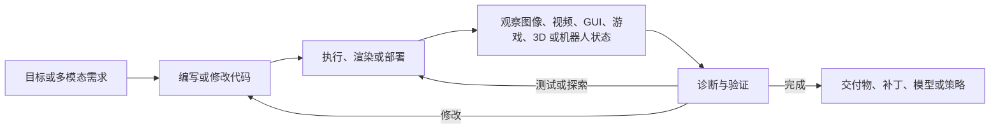

<div align="center">


<br>

***What Can Be Verified Can Be Scaled.***

**看见自己构建的内容，与其交互，并在反馈中持续改进的智能体。**

[](https://awesome.re)
[](./LICENSE)
[](#contributing)
[](#contact-and-collaboration)
[](#paper-and-project-list)

[](./README.md)
[](./README.zh-CN.md)

**最后更新：2026-09-06**

</div>

## 🔥 动态

- **[2026-09-06]** 发布 **v0.1.0**：Awesome Multimodal Agentic Coding 的首个公开版本，收录横跨十个任务领域的 111 项核心工作，并提供实用 Skills、执行引擎地图、精选案例与中英文文档。

<a id="motivation"></a>
## 💡 动机

传统的多模态编程通常意味着：**将图像、视频、图表或设计稿作为代码生成的初始输入**。本仓库关注一个更窄、也更关键的转变：

> **传统多模态编程将视觉作为输入；多模态智能体编程将多模态感知作为反馈。**

> ***我们相信，多模态智能体编程是一种新的多模态范式：视觉不再只是理解任务时的输入模态，而会成为编程闭环中反复用于行动、验证和改进的控制信号。***

研究对象不只是 `多模态输入 → 代码`，而是一条自主或半自主轨迹：可执行代码产生视觉或交互状态，智能体观察这一状态，并让观测结果重新决定后续工作。

在这个范式中，智能体不只是在**编码前看一眼**，而是会在**编码过程中持续观察**，决定何时需要再次观测，并依据所见选择下一步行动。



<a id="definition-and-scope"></a>
## 📌 定义与范围

本仓库采用以下定义：**多模态智能体编程（multimodal agentic coding）**，必须在**同一条 Agent 轨迹**中发生以下四件事：

1. Agent 生成或修改可执行代码，或其他程序化表示；
2. 代码创建或改变一个可执行／可编辑产物，或可执行世界状态；
3. Agent 获得执行后的视觉、时间、空间、交互或具身观测；
4. 该观测改变后续代码或工具动作。

这里的**产物（artifact）**是由代码构建的产品或状态，例如网页、UI、图表、SVG、CAD 模型、3D 场景、游戏、文档、视频、仿真器、数字孪生或机器人策略。

核心纳入判断是：

> **能否在同一条轨迹中追踪到：代码 → 可执行产物 → 执行后的多模态证据 → 后续代码／工具动作？**

Benchmark 可以通过某个明确的 Track、基线方法或已记录的 Agent 配置实现并评测上述闭环，即使其他受评设置并不使用多模态反馈。

### 纳入范围

- 对网页、应用、图表、示意图、3D 场景、CAD 模型、游戏、幻灯片、海报、动画和视频进行迭代生成与修复。
- 在仓库或应用层复现、定位、修复视觉问题，并进行回归验证。
- Coding Agent 在修改代码时主动浏览、检查截图、采样视频帧、操作 GUI、游玩游戏或观察机器人。
- 由 Agent 编写、并依据多模态观测或交互反例修订代码的可执行世界模型与数字孪生。
- 专门围绕上述闭环构建的训练方法、数据集和 Benchmark。

<a id="perspectives"></a>
## ✍️ 观点、博客与产业信号

本节收集带明确作者归属的非同行评审信号，用实践证据补充研究文献，并说明多模态反馈为何正在进入编程闭环。

- `2026-09-05` **Z.ai / AutoClaw Team — GLM-5.3-Flash: More Intelligence with Less Compute.** [[官方博客]](https://autoclaw.z.ai/blog/model/glm-5.3-flash/) [[模型卡]](https://huggingface.co/zai-org/GLM-5.3-Flash)
  > “Vision therefore becomes part of execution and verification rather than a separate input capability.”
  >
  > *与本主题的关联：* 模型被明确描述为能够检查渲染结果、判断下一步行动，并在文档、界面等视觉产物上继续改进。

- `2026-09-03` **OpenAI — GPT-6 Astra 与 Playco 游戏原型案例。** [[官方发布]](https://openai.com/index/gpt-6-astra/) [[Playco 案例]](https://openai.com/index/playco-game-prototyping-with-astra/) [[模型指南]](https://developers.openai.com/api/docs/models/gpt-6-astra)
  > Astra can “create a website, and run frontend QA checks to make sure all the features on that site work.”
  >
  > *与本主题的关联：* 官方发布强调其对网站、游戏、应用和渲染结果的视觉判断；Playco 案例则把闭环具体化为 Unity／Godot 场景编辑、游玩测试、验证、发现 Bug 和继续改进。

- `2026-08-02` **Andrej Karpathy — 长时程 Three.js 实验与评论。** [[X]](https://x.com/karpathy/status/2083749667410727319?s=20) — **本仓库的直接启发来源。**
  > *方向信号：* 大型视觉程序的生成成本正在快速下降，但如何高效地观看、游玩、审计和修复这些程序，仍是核心瓶颈。

<a id="skills-and-tool-bridges"></a>
## 🧰 实用 Agent Skills 与工具桥

论文描述方法，Skill 和工具桥则让这些方法能在真实环境中运行。这里用 **Skill** 表示可复用的流程知识——通常由指令以及可选脚本、参考资料和资源组成；它不同于暴露动作与观测能力的 CLI、MCP Server、API 或插件。

> **操作栈：** `Agent Skill → CLI / MCP / API → 引擎或运行时 → 渲染 / 执行 → 观察 → 修改`

下表是实践起点，不代表安全审计或背书。每项资源都通过面向产物的执行或观测支持代码产物闭环。**Official** 表示由底层平台或项目维护；使用 **Community** 集成前应检查源码并在沙箱中运行。

| 能力 | 资源 | 形式与来源 | 对闭环的意义 |
|---|---|---|---|
| 浏览器构建与测试 | [Playwright MCP](https://github.com/microsoft/playwright-mcp) · [Chrome DevTools MCP](https://github.com/ChromeDevTools/chrome-devtools-mcp) | 官方 MCP / CLI + Skills | 暴露可访问性结构、截图、交互、控制台与网络证据，以及性能 Trace。 |
| 设计到代码与设计回写 | [Figma MCP server](https://developers.figma.com/docs/figma-mcp-server/) | 官方 MCP + Skills | 允许 Agent 检查设计上下文、生成实现代码，并创建或更新原生 Figma 内容。 |
| 文本／图像到 CAD | [text-to-cad](https://github.com/earthtojake/text-to-cad) | 社区 Skill 库 | 覆盖 CAD 生成与编辑、浏览器预览、STEP/DXF/机器人格式、可制造性检查、切片和交付，而不只是一次性几何生成。 |
| 参数化 CAD 执行 | [CadQuery MCP server](https://github.com/CadQuery/cadquery-contrib/tree/master/mcp-server) | 项目托管 MCP | 执行 CadQuery、渲染多视图 SVG、检查拓扑与物理属性，并导出制造格式。 |
| 托管 CAD Agent 与几何 API | [Zoo developer tools](https://docs.zoo.dev/docs) | 官方 MCP / Agent API / Engine API | 将语言驱动的 KCL 工作流连接到几何执行、快照、检查和调试。 |
| Blender 与程序化 3D | [Blender Lab MCP Server](https://www.blender.org/lab/mcp-server/) · [BlenderMCP 社区 Demo](https://github.com/ahujasid/blender-mcp) | 官方 MCP + 社区 Demo 生态 | 支持 Agent 在 Blender 中检查场景并执行 Python；社区 Demo 展示参考图到场景、Blender 到 Three.js 等工作流。 |
| Three.js 与浏览器 3D | [threejs-skills](https://github.com/full-stack-skills/threejs-skills) · [threejs-game-skills](https://github.com/majidmanzarpour/threejs-game-skills) | 社区 Skills | 编码场景、相机、材质、动画、玩法、确定性测试和视觉回归工作流。 |
| 多引擎游戏构建与视觉 QA | [3AGameFactory](https://github.com/OpenDCAI/GameFactory-3A) | 项目托管 Skills + Pipelines + 引擎适配器 | 让 Coding Agent 在 UE5、Unity、Godot、Blender 与 Three.js 中组织资产、玩法和 UI 生成，并要求通过渲染资产审阅、引擎内录制与修复后再验收。 |
| p5.js 视觉创作与审阅 | [ALIGN](https://github.com/wanshuiyin/ALIGN-Agentic-Loop-Image-GeneratioN) | 社区 Skills + 可复现 Demo | 为 Codex 与 Claude Code 封装参考图绘制和方法图工作流：编写 p5.js、渲染、获得独立的像素级审阅、修改程序，并保留决策与版本。 |
| Unity 开发 | [Unity Agent Skills](https://github.com/Unity-Technologies/skills) | 官方 Skills + CLI | 覆盖项目设置、包、UI、Shader、验证以及可重复的编辑器／构建操作。 |
| Godot 开发 | [Godot MCP](https://github.com/hybridindie/godot-mcp) | 社区 MCP | 支持场景与脚本、项目运行、输入驱动、截图、重放、性能分析和导出。 |
| Unreal 开发 | [Unreal MCP](https://github.com/ZiggyMar/unreal-mcp) | 社区 MCP | 以索引化、Token 高效的方式检查和编辑 Unreal 项目与 Blueprint。 |
| Diagram-as-code | [Mermaid MCP server](https://mermaid.ai/docs/ai/mcp-server) | 官方 MCP | 验证 Diagram 语法并返回可供检查与修复的 SVG/PNG 渲染。 |
| 程序化视频 | [Remotion](https://github.com/remotion-dev/remotion) | 官方框架 + Skills | 将 React 代码转化为可检查的视频帧和视频，从而支持逐帧渲染与迭代纠错。 |
| 数学动画 | [Manim MCP](https://github.com/paulnegz/manim-mcp) | 社区 MCP | 把文本、生成的 Manim 代码、渲染视频与后续修正连接成一条工作流。 |

> **安全提示：** 许多集成能够在浏览器、CAD、DCC 工具和游戏引擎中执行代码。评估社区工具时，应检查源码、固定版本、限制文件系统与网络权限，并使用隔离的项目副本。

<a id="execution-and-rendering-engines"></a>
## ⚙️ 执行与渲染引擎地图

引擎不只是输出目标：它决定 Agent 能执行什么、能观察什么，以及验证一次修改的成本。一个实用默认原则是：选择**能够表达目标产物并提供可靠观测的最低复杂度引擎**。

> `HTML/CSS → SVG/Canvas → Three.js/Babylon.js → Blender 或 CAD → Godot/Unity/Unreal → 机器人仿真器`

| 层级 | 常见引擎与运行时 | 典型代码表面 | Agent 可见反馈 |
|---|---|---|---|
| 浏览器基础 | [HTML](https://developer.mozilla.org/en-US/docs/Web/HTML) / [CSS](https://developer.mozilla.org/en-US/docs/Web/CSS) / JavaScript · [SVG](https://developer.mozilla.org/en-US/docs/Web/SVG) · [Canvas](https://developer.mozilla.org/en-US/docs/Web/API/Canvas_API) · [WebGL](https://developer.mozilla.org/en-US/docs/Web/API/WebGL_API) / [WebGPU](https://developer.mozilla.org/en-US/docs/Web/API/WebGPU_API) | 标记、样式、DOM、矢量路径、Shader | DOM／可访问性树、截图、事件、控制台／网络日志、像素 |
| 浏览器 2D 与游戏 | [PixiJS](https://pixijs.com/) · [Phaser](https://phaser.io/) | JavaScript/TypeScript 场景与游戏逻辑 | 帧、指针／键盘行为、碰撞、时序、性能 |
| Web 3D | [Three.js](https://threejs.org/docs/) · [Babylon.js](https://doc.babylonjs.com/) · [React Three Fiber](https://r3f.docs.pmnd.rs/getting-started/introduction) | JavaScript/TypeScript 场景图与 Shader | 多视图截图、相机、物体变换、场景状态、GPU 诊断 |
| 数据可视化 | [D3](https://d3js.org/) · [Vega-Lite](https://vega.github.io/vega-lite/) · [Plotly.js](https://plotly.com/javascript/) | 声明式 Spec 或 JavaScript | SVG/Canvas 渲染、数据／比例尺／图例检查、Hover 与交互状态 |
| Diagram 与文档 | [Mermaid](https://mermaid.js.org/) · [Graphviz](https://graphviz.org/documentation/) · [PlantUML](https://plantuml.com/) · [Typst](https://typst.app/docs/) · [TikZ](https://tikz.dev/) | 文本化 Diagram 或页面描述语言 | 解析／编译错误、SVG/PNG/PDF 渲染、布局与页面几何 |
| CAD 与几何 | [OpenSCAD](https://openscad.org/documentation.html) · [CadQuery](https://cadquery.readthedocs.io/en/latest/) · [build123d](https://build123d.readthedocs.io/en/latest/) · [FreeCAD](https://wiki.freecad.org/Power_users_hub) · [Zoo/KCL](https://zoo.dev/docs/kcl) | 参数化脚本、Feature Tree、约束、B-Rep／Mesh 操作 | 几何有效性、拓扑、边界／体积、多视图渲染、STEP/STL 导出 |
| DCC 与程序化 3D | [Blender Python API](https://docs.blender.org/api/current/) | Python、Geometry Nodes、场景与材质图 | 场景图、物体／材质统计、静帧、多视图渲染、动画 |
| 游戏引擎 | [Godot](https://docs.godotengine.org/en/stable/) · [Unity](https://docs.unity3d.com/Manual/index.html) · [Unreal Engine](https://dev.epicgames.com/documentation/en-us/unreal-engine) | 引擎脚本、场景、Prefab／Node、Shader、Blueprint/C++ | 构建／测试日志、截图、输入轨迹、重放、物理与运行时状态 |
| 动画与视频 | [Manim](https://docs.manim.community/) · [Remotion](https://www.remotion.dev/docs/) · [FFmpeg](https://ffmpeg.org/documentation.html) | Python、React/TypeScript、媒体流水线 | 帧、视频、时序、时长／音频检查、渲染和编码错误 |
| 机器人与仿真 | [MuJoCo](https://mujoco.readthedocs.io/en/stable/overview.html) · [Isaac Sim](https://docs.isaacsim.omniverse.nvidia.com/latest/index.html) · [Gazebo](https://gazebosim.org/docs/latest/getstarted/) · [PyBullet](https://github.com/bulletphysics/bullet3) | 机器人模型、控制器、策略、仿真脚本 | 传感器／状态流、接触、轨迹、Rollout 视频、任务结果 |

这些层级相互补充，而不是互斥。例如，Agent 可以修改 CadQuery 模型，在浏览器 Viewer 中检查，在 Blender 中渲染精细视图，再到仿真器中验证装配行为。因此，评估系统时需要同时记录**产物引擎**和**观测通道**。

<a id="selected-cases-and-demos"></a>
## 🎬 精选 Case 与 Demo

以下例子让不同任务中的编程闭环变得具体可见。我们优先选择作者或官方来源，并标注证据强度：一个案例可能是有价值的**产业概念验证**、**社区 Demo**或**相邻创作信号**，但并不因此自动成为核心闭环研究。

| 任务 | 案例与来源 | 重点观察 | 证据标签 |
|---|---|---|---|
| 视觉软件工程 | **Programming with Pixels** — Aggarwal & Welleck [[项目 + Demo]](https://programmingwithpixels.com/) | Computer-use Agent 观察 VS Code，通过点击与输入修改 UI 代码，并检查实时预览，而不是只依赖文本工具。 | 闭环研究 Demo |
| Web 与 UI 重建 | **WebVIA** — Zhen et al. [[项目 + 案例]](https://zheny2751-dotcom.github.io/webvia.github.io/) | Agent 探索源网页的多种状态，生成可执行 HTML/CSS/JS，再用点击、输入和导航验证行为。 | 闭环研究 Demo |
| 原生设计系统 | **Agents, meet the Figma canvas** — Figma [[官方博客 + Demo]](https://www.figma.com/blog/the-figma-canvas-is-now-open-to-agents/) | Coding Agent 使用真实组件与变量创建或编辑原生 Figma 图层，截图并通过文档明确描述的自修复循环继续迭代。 | 官方产品工作流 |
| 数据可视化 | **VisCoder2** — TIGER AI Lab [[项目 + 案例研究]](https://tiger-ai-lab.github.io/VisCoder2/) | 案例覆盖 Python、Vega-Lite、Mermaid、SVG、LaTeX 等语言，同时展示执行恢复成功与视觉修复失败的情况。 | 闭环研究 Demo |
| 程序化图像与方法图创作 | **ALIGN** — wanshuiyin [[仓库 + 交互式 Gallery]](https://github.com/wanshuiyin/ALIGN-Agentic-Loop-Image-GeneratioN) | Coding Agent 将图像构造成可编辑的 p5.js 程序；独立审阅者检查渲染像素，Critique 在有记录的多轮轨迹中驱动后续代码修改。 | 闭环社区 Demo |
| Raster 到可编辑图形 | **DrawAI Workbench** — Renaissance Mind [[仓库 + Demo]](https://github.com/Renaissance-Mind/DrawAI) | 将论文图、幻灯片和 Diagram 等 Raster 输入转成可编辑 SVG/PPTX；Workbench 暴露中间产物与验证，而不只给最终图像。 | 闭环研究 Demo |
| 文本、草图与扫描到 CAD | **CAD-Assistant** — Mallis et al. [[项目 + 视频]](https://cadassistant.github.io/) | Agent 编写并执行 FreeCAD 动作、观察不断变化的模型，并依据手绘命令或 3D Scan 证据调整后续代码。 | 闭环研究 Demo |
| 程序化 3D | **3DCodeBench** — 3DCodeBench team [[交互式 Gallery]](https://www.3dcodebench.com/) | Agent 执行 Blender 程序、读取错误、重试、多轮细化并视觉自评；网站提供可拖拽 3D 示例。 | 闭环研究 Demo |
| 持续游戏生成 | **Play2Code gallery** — GUI Agents for Continual Game Generation [[可玩 Demo]](https://continual-game-generation.vercel.app/) | GUI Agent 游玩生成的浏览器游戏，将体验轨迹返回给 Coding Agent，后者继续修改游戏。 | 闭环研究 Demo |
| 游戏引擎编程与自验证 | **GPT-6 Astra × Playco Playbot** — OpenAI & Playco [[官方案例]](https://openai.com/index/playco-game-prototyping-with-astra/) | Playbot 连接 Unity 与 Godot；Astra 编辑场景、游玩并测试游戏、验证修改、发现 Bug，再继续改进可玩产物。OpenAI 报告的客户结果为人工修复减少 50%。 | 官方产品案例 |
| 游戏移植与 GPU 修复 | **Speedrun your game port with agentic coding** — Apple [[WWDC26 视频 + Transcript]](https://developer.apple.com/videos/play/wwdc2026/357/) | Agent 移植 MiniEngine、捕获并检查 GPU Trace、修复明显错误的光照和纹理，再依据参考 Capture 验证修复后的渲染。 | 官方工程工作流 |
| 可执行世界模型 | **TWIN interactive replay** — TWIN team [[项目 + Replay]](https://arc-agi-3-twin.vercel.app/) | Agent 为未知游戏编写 Python Twin，对照交互历史验证状态转移，修复首个不一致，并在修订后的模型中规划。 | 闭环研究 Demo |
| 多格式设计 | **AutoDesign Open Research Demo** — Luo et al. [[项目 + 产物]](https://autodesign.designanything.ai/) | 同一篇论文被转成可编辑海报、Slide Deck、研究网站和旁白视频；每次 Rollout 保留可执行产物、渲染、诊断与局部修复。 | 闭环研究 Demo |
| 机器人 Code-as-policy | **ASPIRE task gallery** — NVIDIA GEAR et al. [[项目 + 88 个 Demo]](https://research.nvidia.com/labs/gear/aspire/) | Baseline 与修复后 Rollout 对应 Fix Code：Agent 检查多模态 Trace、重写策略、重新运行，并把验证后的修复保存为可复用 Skill。 | 闭环研究 Demo |

<a id="topic-map"></a>
## 🗺️ 主题地图

分类首先依据正在构建的产物，以及闭合编程循环的反馈通道：

| 主题 | 主要产物 | 典型执行后反馈 |
|---|---|---|
| 通用多模态编程 | 跨领域程序与视觉工具 | 截图、浏览器状态和可执行工具输出 |
| 软件工程与修复 | 仓库与应用 | 视觉问题复现、故障定位和回归证据 |
| Web、UI 与 App 开发 | 网站、界面和全栈应用 | 渲染页面、DOM/GUI 交互和浏览器测试 |
| 数据可视化与科学编程 | 图表、科学 Figure 和分析程序 | 渲染 Plot、运行时错误和科学有效性检查 |
| SVG、Diagram 与结构化图形 | 矢量图与 Diagram | Raster Preview、结构检查和几何比较 |
| 3D、CAD 与场景 | 3D 场景、Mesh 与 CAD 程序 | 多视图渲染、几何检查和 Solver 反馈 |
| 游戏与交互环境 | 可玩游戏与视觉程序 | Gameplay Trace、引擎状态和交互故障 |
| 世界模型与可执行仿真 | 由 Agent 编写的可执行仿真器、数字孪生和世界程序 | 观测到的状态转移、物理结果和反例 |
| 文档、动画与视频 | Slide、海报、文档与时序媒体 | 页面／帧渲染、布局检查和时间一致性 |
| 机器人与具身编程 | 控制器、策略和机器人程序 | 视频、传感器流、Rollout 和任务结果 |

<a id="contribution-tags"></a>
## 🏷️ 标签体系

标签分为两条正交轴：**贡献类型标签**说明一项工作贡献了什么；**研究角色标签**说明这项贡献作用在 Agent 研发闭环的哪个位置。每项工作至少包含一个贡献类型标签，研究角色标签只标记其核心作用环节。

### 贡献类型标签

| 标签 | 含义 |
|---|---|
| `[Method]` | 新的 Agent 方法、框架、模型、算法或优化过程。 |
| `[System]` | 集成式实现，或模型与工具组成的完整系统；这一标签本身不能证明闭环行为。 |
| `[Benchmark]` | 评测任务、环境、协议或 Benchmark Suite。 |
| `[Dataset]` | 作为核心贡献发布了具体的训练、评测或轨迹数据集。 |
| `[Empirical Study]` | 核心贡献是系统性的行为观察、比较、审计或失败分析，而不是新 Agent。 |
| `[Survey]` | Survey、Taxonomy 或 Position Paper。 |

一项工作产生多种实质贡献时，可以同时使用多个贡献类型标签。

### 研究角色标签

| 标签 | 含义 |
|---|---|
| `[Data Curation]` | 构建、合成、过滤、标注、去污染或版本化任务、环境、Demonstration、Preference 或轨迹。这要求数据工程本身是贡献，而不是论文只使用了某个数据集。 |
| `[Training]` | 通过 SFT、蒸馏、偏好优化、RL/RLVR、Heuristic Learning 或其他学习过程更新模型、Policy、Critic、Verifier、Memory、Skill 或 Agent Harness。 |
| `[Inference]` | 通过规划、搜索、反思、记忆、交互、修复、重排或 Test-Time Scaling 改变测试时 Agent 循环。 |
| `[Environment]` | 贡献可复用的可执行基座，例如 Sandbox、Renderer、Simulator、浏览器／游戏 Runtime、Action Interface 或任务环境。 |
| `[Verification]` | 引入 Critic、Judge、Reward、Rubric、Metric 或确定性 Checker，将执行结果转换为分数或可执行的诊断。只做最终评分不等于建立了闭环反馈。 |
| `[Trajectory Analysis]` | 将完整 Action–Observation 历史作为核心研究对象，用于过程特征分析、表征、诊断、失败归因、监控或干预。仅保存日志不足以获得该标签。 |

下面几个区分用来避免标签逐渐失去信息量：

- `[Dataset]` 表示发布了数据集；`[Data Curation]` 表示如何产生可信数据的方法或 Pipeline。一项工作可以同时属于两者。
- `[Benchmark]` 表示测量什么；`[Verification]` 表示如何判断中间状态或最终结果。如果 Benchmark 只使用既有 Verifier，只需要 `[Benchmark]`。
- `[Training]` 必须存在学习更新；仅使用 Prompt、搜索或反思改进的工作属于 `[Inference]`。
- 轨迹只作为训练样本时，使用 `[Training]`；若同时发布数据，再加 `[Dataset]`。只有研究或诊断路径本身时，才使用 `[Trajectory Analysis]`。

下方条目先列贡献类型标签，再在 `·` 分隔符后列研究角色标签。宽口径 Survey 若无法合理归入单一研发环节，可以只保留贡献类型标签。下表展示两条标签轴如何组合：

| 工作 | 贡献类型标签 | 研究角色标签 |
|---|---|---|
| **Learning Only with Images / RRVF** | `[Method]` | `[Training]` `[Inference]` `[Verification]` |
| **Programming with Pixels** | `[Benchmark]` | `[Environment]` `[Verification]` |
| **Rendering-in-the-Loop** | `[Method]` `[Benchmark]` `[Dataset]` | `[Data Curation]` `[Inference]` `[Environment]` `[Verification]` |
| **ReLook** | `[Method]` | `[Training]` `[Inference]` `[Verification]` |

## 📚 目录

- [动机](#motivation)
- [定义与范围](#definition-and-scope)
- [观点、博客与产业信号](#perspectives)
- [实用 Agent Skills 与工具桥](#skills-and-tool-bridges)
- [执行与渲染引擎地图](#execution-and-rendering-engines)
- [精选 Case 与 Demo](#selected-cases-and-demos)
- [主题地图](#topic-map)
- [标签体系](#contribution-tags)
- [论文与项目列表](#paper-and-project-list)
  - [1. 通用多模态编程与视觉问题求解](#general)
  - [2. 多模态软件工程与程序修复](#software-engineering)
  - [3. Web、UI 与 App 开发](#web-ui-app)
  - [4. 数据可视化与科学编程](#visualization)
  - [5. SVG、Diagram 与结构化图形](#svg-diagrams)
  - [6. 3D、CAD 与场景生成](#3d-cad)
  - [7. 游戏与交互环境](#games)
  - [8. 世界模型与可执行仿真](#world-models)
  - [9. Slide、海报、文档、动画与视频](#documents-video)
  - [10. 机器人与具身编程](#robotics)
- [相邻基础](#adjacent-foundations)
- [Survey 与相关资源合集](#surveys-and-related-collections)
- [研究前沿](#research-frontiers)
- [联系、合作与贡献](#contact-and-collaboration)
- [引用](#citation)

---

<a id="paper-and-project-list"></a>
## 📑 论文与项目列表

工作按照**主要任务领域**组织，并大致从新到旧排列。即使跨越多个任务，一项工作也只在核心列表出现一次。每篇论文都附有一句话摘要，概括它与本合集最相关的机制。

`arXiv YYYY.MM` 使用论文来源页面标明的首次提交月份，可能与编号前缀不同。博客日期对应所链接文章的发布日期。

其中的**验证维度**一行提炼论文实际检查的方面——包括编译器、测试、渲染器、几何内核、仿真器、评审模型或人工评测——而不是给所有任务强加同一套指标。

这些维度可能同时包含闭环内检查与最终评测指标。

<a id="general"></a>
### 1. 通用多模态编程与视觉问题求解

跨领域 Coding Agent 在迭代求解中使用图像、浏览器或可执行视觉工具。

- `arXiv 2025.07` **Learning Only with Images: Visual Reinforcement Learning with Reasoning, Rendering, and Visual Feedback**. [[论文]](https://arxiv.org/abs/2507.20766) [[代码]](https://github.com/L-O-I/RRVF) — `[Method]` · `[Training]` `[Inference]` `[Verification]`
  > 运行生成的图表与网页代码，将目标和渲染结果的差异转为视觉反馈，并指导下一轮代码生成。<br>
  > **验证维度：** 代码与格式有效性 · 渲染视觉相似度 · 语义及元素完整性。

<a id="software-engineering"></a>
### 2. 多模态软件工程与程序修复

仓库或应用层 Agent 复现视觉故障、定位相关代码、生成补丁并验证结果。

- `arXiv 2026.07` **VisualRepair: Dynamic Tool Calling and Region Focusing for Visual Software Issue Repair**. [[论文]](https://arxiv.org/abs/2607.14075) — `[Method]` · `[Inference]`
  > 在迭代修复截图驱动的软件问题时，动态选择视觉工具并聚焦可疑区域。<br>
  > **验证维度：** 问题解决率 · 仓库测试通过 · 截图问题修复正确性。
- `arXiv 2026.03` **FailureMem: A Failure-Aware Multimodal Framework for Autonomous Software Repair**. [[论文]](https://arxiv.org/abs/2603.17826) [[代码]](https://github.com/Ruize-Ma/FailureMem) — `[Method]` · `[Inference]`
  > 检索既往多模态失败轨迹，指导诊断及后续仓库级修复动作。<br>
  > **验证维度：** SWE-bench Multimodal 解决率 · 仓库测试通过 · 视觉问题修复。
- `arXiv 2026.02` **SVRepair: Structured Visual Reasoning for Automated Program Repair**. [[论文]](https://arxiv.org/abs/2602.06090) — `[Method]` · `[Inference]`
  > 将截图结构化为局部视觉证据，在场景理解、代码定位与补丁生成之间迭代。<br>
  > **验证维度：** 问题解决率 · 仓库测试通过 · 定位与补丁正确性。
- `arXiv 2025.06` **Seeing is Fixing: Cross-Modal Reasoning with Multimodal LLMs for Visual Software Issue Fixing**. [[论文]](https://arxiv.org/abs/2506.16136) — `[Method]` · `[Inference]` `[Verification]`
  > 结合图像到代码理解与代码到图像验证，闭合视觉软件问题修复循环。<br>
  > **验证维度：** Pass@1 · 仓库测试通过 · 视觉补丁验证。
- `arXiv 2025.02` **Programming with Pixels: Can Computer-Use Agents do Software Engineering?**. [[论文]](https://arxiv.org/abs/2502.18525) [[代码]](https://github.com/ProgrammingwithPixels/PwP) [[项目]](https://programmingwithpixels.com/) — `[Benchmark]` · `[Environment]` `[Verification]`
  > 评测必须观察并操作视觉 IDE、而不能只依赖文本工具接口的 Coding Agent。<br>
  > **验证维度：** 基于执行的任务完成 · 单元测试通过 · IDE 最终状态。
- `arXiv 2024.11` **DesignRepair: Dual-Stream Design Guideline-Aware Frontend Repair with Large Language Models**. [[论文]](https://arxiv.org/abs/2411.01606) [[代码]](https://github.com/UGAIForge/DesignRepair) — `[Method]` · `[Inference]` `[Verification]`
  > 联合推理前端源码和渲染视图，并使用设计规范指导迭代式视觉修复。<br>
  > **验证维度：** 违规检测精确率／召回率 · 修复精确率／召回率 · 感知视觉质量。

<a id="web-ui-app"></a>
### 3. Web、UI 与 App 开发

反复生成、部署、查看、交互和修复网站或应用的 Agent 与 Benchmark。

- `arXiv 2026.09` **Rendering-in-the-Loop: An Execution-Driven Agent for Interactive Web Development**. [[论文]](https://arxiv.org/abs/2609.02088) — `[Method]` `[Benchmark]` `[Dataset]` · `[Data Curation]` `[Inference]` `[Environment]` `[Verification]`
  > 在真实浏览器中重放参考交互，同时评估行为与渲染，再将多模态运行证据转化为多轮工具辅助代码修复。<br>
  > **验证维度：** 交互执行成功率 · SSIM/OCR/语义视觉保真度 · 修复轮次间提升。
- `arXiv 2026.08` **Rubrics as Visual-Repair Context for Self-Evolving UI-to-Code Generation**. [[论文]](https://arxiv.org/abs/2608.24138) — `[Method]` · `[Inference]` `[Verification]`
  > 使用持久化视觉修复 Rubric 选择限定范围的修改，减少多轮 UI 细化中的回归。<br>
  > **验证维度：** 整体视觉保真度 · 五类 UI 分项评分 · 修复轮次间回退。
- `arXiv 2026.08` **MT-Web2Code: Benchmarking Coding Agents on Multi-Turn Regional Reconstruction and Localized Modification**. [[论文]](https://arxiv.org/abs/2608.03474) — `[Benchmark]` · `[Data Curation]` `[Environment]` `[Verification]`
  > 评测多轮 Agent 的局部网页重建与修改，而不是一次性截图模仿。<br>
  > **验证维度：** 区域内保真度 · 区域外保持度 · 宏观／微观编辑成功率。
- `arXiv 2026.04` **InteractWeb-Bench: Can Multimodal Agent Escape Blind Execution in Interactive Website Generation?**. [[论文]](https://arxiv.org/abs/2604.27419) — `[Benchmark]` · `[Data Curation]` `[Environment]` `[Verification]`
  > 评测“澄清—实现—验证—提交”闭环：浏览器检查返回失败截图与有依据的诊断，指导 Agent 下一轮代码修改。<br>
  > **验证维度：** 基于 Oracle Slot 的 Task Completion Rate · 多余元素 Hallucination Rate · 功能与视觉需求满足。
- `arXiv 2026.04` **PlayCoder: Making LLM-Generated GUI Code Playable**. [[论文]](https://arxiv.org/abs/2604.19742) [[代码]](https://github.com/Tencent/PlayCoder) — `[Method]` `[Benchmark]` · `[Inference]` `[Environment]` `[Verification]`
  > 自动运行并操作生成的 GUI，再把交互失败转化为后续代码修复。<br>
  > **验证维度：** Exec@k · 单元测试 Pass@k · 交互 Play@k · Token 效率。
- `arXiv 2026.04` **Vision-Guided Iterative Refinement for Frontend Code Generation**. [[论文]](https://arxiv.org/abs/2604.05839) — `[Method]` · `[Inference]` `[Verification]`
  > 将前端渲染差异反馈到反复代码修改中，而不是在初次生成后停止。<br>
  > **验证维度：** 视觉任务完成度 · 美学质量 · 代码任务完成度 · 代码质量。
- `arXiv 2026.03` **Coding with Eyes: Visual Feedback Unlocks Reliable GUI Code Generating and Debugging**. [[论文]](https://arxiv.org/abs/2604.19750) — `[Method]` `[Benchmark]` · `[Inference]` `[Environment]` `[Verification]`
  > 在执行驱动的调试闭环中协调视觉理解、GUI 交互、代码生成与重构。<br>
  > **验证维度：** 应用执行 · 元素／颜色／布局断言 · 交互状态正确性。
- `arXiv 2026.02` **1D-Bench: A Benchmark for Iterative UI Code Generation with Visual Feedback in Real-World**. [[论文]](https://arxiv.org/abs/2602.18548) — `[Benchmark]` · `[Data Curation]` `[Environment]` `[Verification]`
  > 衡量真实环境中多轮视觉反馈和局部代码更新下的 UI Coding 表现。<br>
  > **验证维度：** 渲染成功 · 视觉相似度 · 多轮反馈改进幅度。
- `arXiv 2026.02` **VisRefiner: Learning from Visual Differences for Screenshot-to-Code Generation**. [[论文]](https://arxiv.org/abs/2602.05998) — `[Method]` `[Dataset]` · `[Data Curation]` `[Training]` `[Inference]` `[Verification]`
  > 从目标与渲染结果的视觉差异中学习，并将证据用于迭代代码细化。<br>
  > **验证维度：** HTML/CSS 有效性 · 区块／文本／位置／颜色／CLIP 保真度 · 迭代改进。
- `arXiv 2025.12` **FronTalk: Benchmarking Front-End Development as Conversational Code Generation with Multi-Modal Feedback**. [[论文]](https://arxiv.org/abs/2601.04203) [[代码]](https://github.com/shirley-wu/frontalk) [[项目]](https://frontalk-benchmark.github.io/) — `[Method]` `[Benchmark]` `[Dataset]` · `[Data Curation]` `[Inference]` `[Environment]` `[Verification]`
  > 引入多轮视觉前端对话与 AceCoder；后者与渲染网站交互、批评失败并重新生成改进代码。<br>
  > **验证维度：** 交互通过率 · 可用性 · 遗忘／回退率。
- `arXiv 2025.11` **Computer-Use Agents as Judges for Generative User Interface**. [[论文]](https://arxiv.org/abs/2511.15567) [[代码]](https://github.com/showlab/AUI) [[项目]](https://showlab.github.io/AUI/) — `[Method]` `[Benchmark]` `[Dataset]` · `[Data Curation]` `[Inference]` `[Environment]` `[Verification]`
  > 将 Coding Model 与测试生成界面的 Computer-use Agent 配对，并把视觉交互历史返回用于重新设计。<br>
  > **验证维度：** GUI 任务成功率 · 交互可解性 · 验证器与人工一致性。
- `arXiv 2025.11` **UI2Code^N: UI-to-Code Generation as Interactive Visual Optimization**. [[论文]](https://arxiv.org/abs/2511.08195) [[代码]](https://github.com/zai-org/UI2Code_N) — `[Method]` · `[Inference]` `[Verification]`
  > 将 UI-to-code 重构为执行、视觉检查和反复细化，并以相对视觉反馈进行优化。<br>
  > **验证维度：** 渲染有效性 · 成对视觉偏好 · 起草与润色质量。
- `arXiv 2025.11` **WebVIA: A Web-based Vision-Language Agentic Framework for Interactive and Verifiable UI-to-Code Generation**. [[论文]](https://arxiv.org/abs/2511.06251) [[代码]](https://github.com/zheny2751-dotcom/WebVIA) [[项目]](https://zheny2751-dotcom.github.io/webvia.github.io/) — `[Method]` `[Benchmark]` `[Dataset]` · `[Data Curation]` `[Inference]` `[Environment]` `[Verification]`
  > 通过反复的感知—行动—验证探索源界面，合成可执行交互代码并验证恢复出的行为。<br>
  > **验证维度：** 结构保真度 · 端到端交互完成率 · 动作有效性。
- `arXiv 2025.10` **ReLook: Vision-Grounded RL with a Multimodal LLM Critic for Agentic Web Coding**. [[论文]](https://arxiv.org/abs/2510.11498) — `[Method]` · `[Training]` `[Inference]` `[Verification]`
  > 在训练 Rollout 与带 Critic 设置中，将基于截图的 MLLM 诊断反馈给后续代码修改；快速推理变体会移除外部 Critic。<br>
  > **验证维度：** Valid Render Rate · ArtifactsBench 视觉／交互评分 · 被接受修改的质量提升。
- `arXiv 2025.09` **WebGen-Agent: Enhancing Interactive Website Generation with Multi-Level Feedback and Step-Level Reinforcement Learning**. [[论文]](https://arxiv.org/abs/2509.22644) [[代码]](https://github.com/mnluzimu/WebGen-Agent) — `[Method]` · `[Training]` `[Inference]` `[Verification]`
  > 使用截图、GUI Agent 测试、回溯和步骤级奖励，迭代改进网站代码库。<br>
  > **验证维度：** 截图外观 · GUI Agent 任务成功率 · 最佳状态改进。
- `arXiv 2025.06` **DesignCoder: Hierarchy-Aware and Self-Correcting UI Code Generation with Large Language Models**. [[论文]](https://arxiv.org/abs/2506.13663) — `[Method]` · `[Inference]` `[Verification]`
  > 捕获渲染后的移动端 UI，比较组件级视觉证据，并迭代应用局部代码修复。<br>
  > **验证维度：** MSE／CLIP／SSIM 视觉保真度 · 组件树相似度 · 用户可用性评分。

<a id="visualization"></a>
### 4. 数据可视化与科学编程

执行分析或绘图代码、检查视觉或科学结果，并修改程序或分析计划的 Agent。

- `arXiv 2026.08` **VisEditBench: Can Vision-Language Models Edit Visualization Code from Multimodal Feedback?**. [[论文]](https://arxiv.org/abs/2608.10408) [[仓库（待发布实现）]](https://github.com/vis-nlp/VisEditBench) — `[Method]` `[Benchmark]` `[Dataset]` · `[Data Curation]` `[Inference]` `[Environment]` `[Verification]`
  > 提出图表修复与风格迁移任务，并以 VisEditAgent 反复执行、视觉验证和修改候选代码，同时保持数据语义。<br>
  > **验证维度：** 可执行性 · 任务准确率 · 可读性／清晰度 · 视觉质量／相似度 · 最终通过率。
- `arXiv 2026.05` **LiveFigure: Generating Editable Scientific Illustration with VLM Agents**. [[论文]](https://arxiv.org/abs/2605.23527) [[代码]](https://github.com/tsinghua-fib-lab/LiveFigure) — `[Method]` · `[Inference]` `[Verification]`
  > 将可编辑科学 Figure 生成为可执行产物，并用视觉反馈进行诊断和修改。<br>
  > **验证维度：** 视觉设计 · 信息清晰度与可读性 · 内容保真与完整性 · 可编辑性。
- `arXiv 2026.05` **Toward AI VIS Co-Scientists: A General and End-to-End Agent Harness for Solving Complex Data Visualization Tasks**. [[论文]](https://arxiv.org/abs/2605.21825) — `[Method]` · `[Inference]` `[Environment]` `[Verification]`
  > 为复杂可视化工作流提供端到端的规划、执行、观察与修改 Harness。<br>
  > **验证维度：** 浏览器执行与控制台健康 · 控件／联动视图行为 · 视觉与科学正确性。
- `arXiv 2026.04` **MM-ReCoder: Advancing Chart-to-Code Generation with Reinforcement Learning and Self-Correction**. [[论文]](https://arxiv.org/abs/2604.01600) [[代码]](https://github.com/ZitianTang/MMReCoder) — `[Method]` · `[Training]` `[Inference]` `[Verification]`
  > 将多模态强化学习与渲染图表自修正结合，用于迭代改进 Chart Code。<br>
  > **验证维度：** 执行率 · 文本／类型／颜色／布局保真度 · VLM 高层评分。
- `arXiv 2026.03` **RealChart2Code: Advancing Chart-to-Code Generation with Real Data and Multi-Task Evaluation**. [[论文]](https://arxiv.org/abs/2603.25804) [[代码]](https://github.com/Speakn0w/RealChart2Code) — `[Benchmark]` · `[Data Curation]` `[Environment]` `[Verification]`
  > 使用真实图表及其底层数据，评测生成、编辑与迭代式 Chart-to-code。<br>
  > **验证维度：** 沙箱通过率 · 八维视觉准确性 · 数据模式一致性 · 设计质量。
- `arXiv 2026.02` **ChartEditBench: Evaluating Grounded Multi-Turn Chart Editing in Multimodal Language Models**. [[论文]](https://arxiv.org/abs/2602.15758) — `[Benchmark]` · `[Data Curation]` `[Environment]` `[Verification]`
  > 评测有现实依据的多轮图表编辑，要求每条视觉指令都反映在更新后的图表产物中。<br>
  > **验证维度：** 语法／执行／渲染／结构有效性 · 编辑指令满足度 · 跨轮保持度。
- `arXiv 2026.02` **Perceptual Self-Reflection in Agentic Physics Simulation Code Generation**. [[论文]](https://arxiv.org/abs/2602.12311) — `[Method]` · `[Inference]` `[Verification]`
  > 将渲染动画帧交给物理 Validator，使生成的仿真代码能够被诊断并自我修正。<br>
  > **验证维度：** 代码执行 · 帧级任务条件 · 动态物理正确性。
- `arXiv 2025.10` **VisCoder2: Building Multi-Language Visualization Coding Agents**. [[论文]](https://arxiv.org/abs/2510.23642) [[代码]](https://github.com/TIGER-AI-Lab/VisCoder2) [[项目]](https://tiger-ai-lab.github.io/VisCoder2/) — `[Method]` `[Dataset]` · `[Data Curation]` `[Training]` `[Inference]` `[Verification]`
  > 使用可执行反馈与面向修复的数据，构建跨编程语言的可视化 Coding Agent。<br>
  > **验证维度：** 执行通过 · 指令遵循 · 视觉相似度 · 多轮恢复能力。
- `arXiv 2025.06` **Improved Iterative Refinement for Chart-to-Code Generation via Structured Instruction**. [[论文]](https://arxiv.org/abs/2506.14837) — `[Method]` · `[Inference]` `[Verification]`
  > 将视觉差异反馈结构化为可行动指令，用于反复修改 Chart Code。<br>
  > **验证维度：** VLM 视觉质量 · 文本／布局／类型／颜色保真度 · PSNR／SSIM／MSE。
- `arXiv 2025.02` **METAL: A Multi-Agent Framework for Chart Generation with Test-Time Scaling**. [[论文]](https://arxiv.org/abs/2502.17651) [[代码]](https://github.com/metal-chart-generation/metal) — `[Method]` · `[Inference]` `[Verification]`
  > 通过协作的生成、视觉检查和修改 Agent 扩展测试时图表生成。<br>
  > **验证维度：** 文本／类型／颜色／布局 F1 · 多准则验证得分。
- `arXiv 2025.02` **Automated Visualization Code Synthesis via Multi-Path Reasoning and Feedback-Driven Optimization**. [[论文]](https://arxiv.org/abs/2502.11140) — `[Method]` · `[Inference]` `[Verification]`
  > 执行多条候选可视化程序，评估渲染结果，并将针对性反馈聚合进修订方案。<br>
  > **验证维度：** 无错误执行 · 图表相似度 · 代码正确性。
- `arXiv 2025.02` **PlotGen: Multi-Agent LLM-based Scientific Data Visualization via Multimodal Feedback**. [[论文]](https://arxiv.org/abs/2502.00988) — `[Method]` · `[Inference]` `[Verification]`
  > 协调代码生成以及数值、词汇和视觉反馈 Agent，迭代细化科学 Plot。<br>
  > **验证维度：** 数值保真度 · 文本标注 · 视觉美学 · 人工质量评分。
- `arXiv 2024.02` **MatPlotAgent: Method and Evaluation for LLM-Based Agentic Scientific Data Visualization**. [[论文]](https://arxiv.org/abs/2402.11453) [[代码]](https://github.com/thunlp/MatPlotAgent) — `[Method]` `[Benchmark]` · `[Inference]` `[Verification]`
  > 规划并执行科学绘图代码，再利用多模态反馈改进生成的可视化。<br>
  > **验证维度：** 代码执行 · GPT-4V 视觉评分 · 与人工评审的相关性。

<a id="svg-diagrams"></a>
### 5. SVG、Diagram 与结构化图形

将矢量图或 Diagram Code 视为可编辑符号产物，并反复渲染、检查和修复的 Agent。

- `arXiv 2026.08` **DrawAI: Agentic Benchmark and Workflow for Making Raster Images Editable**. [[论文]](https://arxiv.org/abs/2608.00548) [[代码]](https://github.com/Renaissance-Mind/DrawAI) [[项目]](https://drawai.renaissancemind.ai/) — `[Method]` `[Benchmark]` · `[Data Curation]` `[Inference]` `[Verification]`
  > 通过 Agentic 生成、渲染与修正流程，将 Raster 参考图转成可编辑结构化图形。<br>
  > **验证维度：** 渲染保真度 · 结构可编辑性 · 文本／图像／公式／形状／连接线／表格准则。
- `arXiv 2026.07` **GVR-Coder: A Visual-Feedback Framework for Structured SVG Generation in Complex Document and Meeting Scenarios**. [[论文]](https://arxiv.org/abs/2607.28073) [[代码]](https://github.com/CurryaNa/GVR-Coder) — `[Method]` `[Dataset]` · `[Data Curation]` `[Training]` `[Inference]` `[Verification]`
  > 在复杂文档需求下，为结构化 SVG 程序实现“生成—可视化—细化”循环。<br>
  > **验证维度：** SVG 渲染有效性 · 重叠／连通／溢出／杂乱／对齐／遮挡 · 结构复杂度。
- `arXiv 2026.07` **RefineSVG: Visual Feedback-Driven Reinforcement Learning for Image-to-SVG Generation**. [[论文]](https://arxiv.org/abs/2607.27699) [[代码]](https://github.com/liuxiaobo66/RefineSVG) — `[Method]` `[Dataset]` · `[Data Curation]` `[Training]` `[Inference]` `[Verification]`
  > 渲染初始 SVG，将目标与渲染残差转为纠错信号，并训练 Draft-then-refine 策略。<br>
  > **验证维度：** 渲染有效性 · 像素结构保真度 · 语义对齐 · 代码效率。
- `arXiv 2026.07` **Exploring Agentic Workflows for Generating High Quality Math Visual Aids**. [[论文]](https://arxiv.org/abs/2607.09839) [[代码]](https://github.com/ashnakhetan/self-improve-math-diagrams) — `[Method]` · `[Inference]` `[Verification]`
  > 生成 TikZ Diagram，对渲染图像提出 QA 问题，并把未满足的视觉检查反馈给后续代码再生成。<br>
  > **验证维度：** 基于代码与图像的问答正确性 · 人工一致性 · 教学有效性。
- `arXiv 2026.04` **Imperfect Visual Verification for Code Edition: A Case Study on TikZ**. [[论文]](https://arxiv.org/abs/2606.15693) — `[Method]` · `[Inference]` `[Verification]`
  > 研究不完美视觉 Verifier 如何评分 TikZ 渲染编辑，以及反馈能否帮助多轮生成得到更好的代码。<br>
  > **验证维度：** 指令应用检测 · 评分准确性 · 反馈有效性 · 人工一致性。
- `arXiv 2026.03` **Feynman: Knowledge-Infused Diagramming Agent for Scalable Visual Designs**. [[论文]](https://arxiv.org/abs/2603.12597) — `[Method]` `[Dataset]` · `[Data Curation]` `[Inference]` `[Verification]`
  > 将领域知识与迭代式 Diagram 构建、视觉检查结合，生成可扩展的可编辑设计。<br>
  > **验证维度：** 程序编译 · 知识与标签正确性 · 视觉对齐与可读性。
- `arXiv 2026.03` **IntroSVG: Learning from Rendering Feedback for Text-to-SVG Generation via an Introspective Generator-Critic Framework**. [[论文]](https://arxiv.org/abs/2603.09312) — `[Method]` · `[Data Curation]` `[Training]` `[Inference]` `[Verification]`
  > 使用 Generator–Critic 循环检查渲染 SVG，并将观察转化为后续程序修改。<br>
  > **验证维度：** CairoSVG 渲染成功 · 视觉质量／FID · 文本语义对齐 · 人工偏好。
- `arXiv 2026.02` **DesignAsCode: Bridging Structural Editability and Visual Fidelity in Graphic Design Generation**. [[论文]](https://arxiv.org/abs/2602.17690) — `[Method]` · `[Inference]` `[Verification]`
  > 通过 Plan–Implement–Reflect 流程和视觉感知反思，修复可执行 HTML/CSS 设计中的渲染缺陷。<br>
  > **验证维度：** 结构有效性 · 对齐／可读性／CLIP · 文本／图像／布局／颜色质量 · 人工美学评分。
- `arXiv 2025.11` **VCode: a Multimodal Coding Benchmark with SVG as Symbolic Visual Representation**. [[论文]](https://arxiv.org/abs/2511.02778) — `[Method]` `[Benchmark]` · `[Data Curation]` `[Inference]` `[Verification]`
  > 以可执行、可编辑的 SVG Code 作为符号化视觉表示，支持并评测其迭代生成。<br>
  > **验证维度：** SVG 渲染成功 · SigLIP 语义保真度 · CodeVQA 推理保持度。
- `arXiv 2025.08` **See it. Say it. Sorted: Agentic System for Compositional Diagram Generation**. [[论文]](https://arxiv.org/abs/2508.15222) — `[Method]` · `[Inference]` `[Verification]`
  > 协调视觉理解与基于代码的 SVG 构建，迭代地将草图转成组合式 Diagram。<br>
  > **验证维度：** 草图结构保真度 · 图元数量与方向 · 空间对齐。

<a id="3d-cad"></a>
### 6. 3D、CAD 与场景生成

生成可执行图形或 CAD 程序，并利用渲染视图、Solver 反馈或几何检查进行修改的 Agent。

- `arXiv 2026.09` **VisCAD: A Foundation Model Suite with Multimodal Industrial CAD Intelligence**. [[论文]](https://arxiv.org/abs/2609.03811) — `[Method]` `[System]` `[Benchmark]` · `[Data Curation]` `[Training]` `[Inference]` `[Environment]` `[Verification]`
  > 生成可执行 FreeCAD 程序，并评测观察六视图渲染后继续改写程序的顺序版本；论文报告该顺序闭环没有提升，而并行视觉重排有效。<br>
  > **验证维度：** FreeCAD 程序执行 · 六视图 Mesh 渲染 · Solid/Surface IoU · 视觉 Judge 分数 · 顺序细化结果。
- `arXiv 2026.08` **IterCAD: Iterative Program Repair for CAD Code Generation from Orthographic Views**. [[论文]](https://arxiv.org/abs/2608.24020) — `[Method]` `[Dataset]` · `[Data Curation]` `[Training]` `[Inference]` `[Environment]` `[Verification]`
  > 使用正交视图证据，在多轮渲染与比较中修复 CAD 程序。<br>
  > **验证维度：** 可执行性 · 体积 IoU · 平均／中位 Chamfer 距离 · 修改／停止判断正确性。
- `arXiv 2026.08` **aDSL: Agentic 3D Creation via Joint Agent-Program Design**. [[论文]](https://arxiv.org/abs/2608.17975) — `[Method]` · `[Inference]` `[Environment]`
  > 联合设计 Agent 工作流与领域专用程序表示，以支持迭代式 3D 创建。<br>
  > **验证维度：** 提示对齐 · 几何与视觉质量 · 文本／图像到形状相似度。
- `arXiv 2026.08` **OmniMech: All-in-one Multimodal Mechanical Benchmark for 3D Reconstruction**. [[论文]](https://arxiv.org/abs/2608.05539) [[项目]](https://omnimech.dev/) [[代码]](https://omnimech.dev/res/omnimech_code.zip) [[样例]](https://omnimech.dev/res/omnimech_samples.zip) — `[Benchmark]` `[Dataset]` · `[Data Curation]` `[Environment]` `[Verification]`
  > 以 25.1 万组机械工程图—CAD 配对数据评测可执行、可编辑的 3D CAD 重建；工具增强 Track 通过渲染、测量、CAD 执行和验证进行迭代改进。<br>
  > **验证维度：** CAD 程序合法性与可执行性 · CD／SIoU／VIoU／Surface F-score · 表面积／体积误差 · 推理／Token／工具调用效率。
- `arXiv 2026.08` **WorldClaw: Agentic 3D Open-World Generation at Scale**. [[论文]](https://arxiv.org/abs/2608.05248) [[代码]](https://github.com/Tencent-Hunyuan/Hunyuan3D-WorldClaw) — `[Method]` · `[Inference]` `[Verification]`
  > 通过反复代码生成、渲染、视觉审计和场景修正构建大型 3D 世界。<br>
  > **验证维度：** 地形与区域组织 · 内容丰富度与提示对齐 · 自由视点外观 · 场景表示（定性）。
- `arXiv 2026.07` **From Pixels to PCells: A Neurosymbolic Approach to Photonic Component Creation**. [[论文]](https://arxiv.org/abs/2608.00084) — `[Method]` `[Dataset]` · `[Data Curation]` `[Training]` `[Inference]` `[Environment]` `[Verification]`
  > 使用参数化光子 DSL 和确定性视觉 Verifier，驱动反复程序修改与 Verifier 引导训练。<br>
  > **验证维度：** 程序／DSL 合规 · 几何 IoU · 参数响应 · 禁用图元门控。
- `arXiv 2026.06` **IterCAD: An Iterative Multimodal Agent for Visually-Grounded CAD Generation and Editing**. [[论文]](https://arxiv.org/abs/2606.13368) — `[Method]` `[Benchmark]` · `[Data Curation]` `[Inference]` `[Environment]` `[Verification]`
  > 将多模态 Agent 放入 CAD Sandbox，进行反复执行、视觉检查、编辑与恢复。<br>
  > **验证维度：** 无效率 · 轮次结果 AUC · Chamfer 距离 · 拓扑保持度。
- `arXiv 2026.06` **Thinking in Blender: Staged Executable Inverse Graphics with Vision-Language Models**. [[论文]](https://arxiv.org/abs/2606.02580) — `[Method]` · `[Inference]` `[Verification]`
  > 将逆图形推理组织为分阶段可执行 Blender 程序，通过渲染暴露错误以供后续修改。<br>
  > **验证维度：** 像素／感知／语义渲染保真度 · 几何／材质／布局／光照恢复 · 可编辑性。
- `arXiv 2026.05` **3DCodeBench: Benchmarking Agentic Procedural 3D Modeling Via Code**. [[论文]](https://arxiv.org/abs/2606.01057) [[项目]](https://www.3dcodebench.com/) — `[Benchmark]` `[Dataset]` · `[Data Curation]` `[Environment]` `[Verification]`
  > 使用可执行程序和渲染输出评估，测试 Coding Agent 的程序化 3D 建模能力。<br>
  > **验证维度：** Blender 执行 · 多视图 SigLIP／DINO · Chamfer／Uni3D 几何 · 人工偏好 Elo。
- `arXiv 2026.05` **Self-Improving CAD Generation Agents with Finite Element Analysis as Feedback**. [[论文]](https://arxiv.org/abs/2605.17448) — `[Method]` · `[Inference]` `[Verification]`
  > 将有限元仿真结果作为反馈，反复改进 CAD 程序。<br>
  > **验证维度：** CAD／STEP 执行 · 应力／位移／模态／屈曲／接触／间隙要求 · 严格与平均需求通过率。
- `arXiv 2026.04` **Agent-Aided Design for Dynamic CAD Models**. [[论文]](https://arxiv.org/abs/2604.15184) — `[Method]` · `[Inference]` `[Environment]` `[Verification]`
  > 通过 Agent 引导的执行反馈，支持动态 CAD 程序的迭代构建与修改。<br>
  > **验证维度：** 编译成功 · 装配约束满足 · 关节／自由度运动 · 视觉相似度。
- `arXiv 2026.04` **ArtiCAD: Articulated CAD Assembly Design via Multi-Agent Code Generation**. [[论文]](https://arxiv.org/abs/2604.10992) — `[Method]` `[Benchmark]` · `[Data Curation]` `[Inference]` `[Environment]` `[Verification]`
  > 生成关节式装配代码，并反复检查执行、几何与视觉正确性。<br>
  > **验证维度：** 脚本执行 · 形状／比例／方向 · 放置／干涉 · 关节运动保真度。
- `arXiv 2026.03` **CADSmith: Multi-Agent CAD Generation with Programmatic Geometric Validation**. [[论文]](https://arxiv.org/abs/2603.26512) [[代码]](https://github.com/jabarkle/CADSmith) — `[Method]` `[Benchmark]` · `[Data Curation]` `[Inference]` `[Environment]` `[Verification]`
  > 在修复循环中结合 CAD 代码生成、确定性几何验证和视觉审阅。<br>
  > **验证维度：** 封闭实体有效性 · 内核尺寸／拓扑 · Chamfer／F1／体积 IoU · 视觉特征覆盖。
- `arXiv 2026.03` **SceneAssistant: A Visual Feedback Agent for Open-Vocabulary 3D Scene Generation**. [[论文]](https://arxiv.org/abs/2603.12238) — `[Method]` · `[Inference]` `[Verification]`
  > 检查渲染后的 3D 场景，并将物体、布局和外观错误转成后续场景编辑。<br>
  > **验证维度：** 布局正确性 · 物体质量 · 人工偏好。
- `arXiv 2026.02` **CADReasoner: Iterative Program Editing for CAD Reverse Engineering**. [[论文]](https://arxiv.org/abs/2603.29847) — `[Method]` · `[Inference]` `[Verification]`
  > 根据目标与当前重建的几何差异，结合多视角渲染和点云反馈，逐步重写可运行的 CadQuery 程序。<br>
  > **验证维度：** 中位数 Chamfer Distance · volumetric IoU · Invalid Rate · 多步细化中的最佳质量。
- `arXiv 2026.01` **Vision-as-Inverse-Graphics Agent via Interleaved Multimodal Reasoning**. [[论文]](https://arxiv.org/abs/2601.11109) — `[Method]` · `[Inference]` `[Verification]`
  > 交错进行代码生成、渲染和多模态推理，以细化可执行逆图形假设。<br>
  > **验证维度：** 光度／感知／语义保真度 · 多步编辑 · 未编辑元素保持度。
- `arXiv 2025.08` **LL3M: Large Language 3D Modelers**. [[论文]](https://arxiv.org/abs/2508.08228) [[项目]](https://threedle.github.io/ll3m/) — `[Method]` · `[Inference]` `[Verification]`
  > 编写模块化 Blender Python，再通过渲染产物 Critic 与验证 Agent 驱动自动局部修改，之后可继续接收用户编辑指令。<br>
  > **验证维度：** 代码执行错误率 · 复杂 Blender 操作使用量 · 渲染几何／材质／需求一致性。
- `arXiv 2025.08` **CADDesigner: Conceptual CAD Model Generation with a General-Purpose Agent**. [[论文]](https://arxiv.org/abs/2508.01031) — `[Method]` · `[Inference]` `[Verification]`
  > 根据文本或草图生成概念 CAD 程序，并通过迭代视觉反馈和累积设计知识继续改进。<br>
  > **验证维度：** 代码成功率／Pass@1 · IoU／Chamfer／Hausdorff 几何 · 重试与效率。
- `arXiv 2024.12` **CAD-Assistant: Tool-Augmented VLLMs as Generic CAD Task Solvers**. [[论文]](https://arxiv.org/abs/2412.13810) [[代码]](https://github.com/dimitrismallis/CAD-Assistant) [[项目]](https://cadassistant.github.io/) — `[Method]` · `[Inference]` `[Environment]`
  > 生成并执行 FreeCAD 代码动作，检查不断变化的多模态 CAD 状态，并调整后续动作。<br>
  > **验证维度：** 2D／3D CAD 问答准确率 · 图元／约束 F1 · 工具增强任务成功率。
- `arXiv 2024.10` **Generating CAD Code with Vision-Language Models for 3D Designs**. [[论文]](https://arxiv.org/abs/2410.05340) [[代码]](https://github.com/Kamel773/CAD_Code_Generation) — `[Method]` `[Benchmark]` · `[Data Curation]` `[Inference]` `[Verification]`
  > 研究具有可执行反馈和迭代设计修正的视觉 Grounded CAD 代码生成。<br>
  > **验证维度：** CAD 代码执行 · 几何尺寸／拓扑／体积 · 视觉相似度。
- `arXiv 2024.07` **CityX: Controllable Procedural Content Generation for Unbounded 3D Cities**. [[论文]](https://arxiv.org/abs/2407.17572) [[项目]](https://cityx-lab.github.io/) [[代码]](https://github.com/cityx-lab/CityX-Lab) — `[Method]` · `[Inference]` `[Environment]` `[Verification]`
  > 将多模态城市需求转为程序化 Blender 构建代码，并将渲染几何与材质的差异返回 Planner，驱动下一步构建。<br>
  > **验证维度：** Executability Rate（ER@1）· Success Rate（SR@1）· 渲染几何／材质一致性 · 人工美学评分。
- `arXiv 2024.03` **SceneCraft: An LLM Agent for Synthesizing 3D Scene as Blender Code**. [[论文]](https://arxiv.org/abs/2403.01248) — `[Method]` · `[Inference]` `[Verification]`
  > 从场景图生成 Blender 脚本，反复根据渲染图诊断修改布局约束与可复用的场景构建函数。<br>
  > **验证维度：** 空间约束通过分数 · CLIP score · 人工偏好。

<a id="games"></a>
### 7. 游戏与交互环境

要求生成的游戏或视觉程序被启动、游玩、检查和调试的 Agent 与 Benchmark。

- `开源系统 2026.09` **3AGameFactory: Open-Source 3A Game Generation Skills and Asset Framework**. [[仓库]](https://github.com/OpenDCAI/GameFactory-3A) — `[System]` · `[Inference]` `[Environment]` `[Verification]`
  > 使用 Coding Agent 跨 UE5、Unity、Godot、Blender 与 Three.js 组装可编辑资产、玩法、UI 和引擎代码；渲染资产图与引擎内录制会暴露视觉缺陷，以触发重新生成或定向修复。<br>
  > **验证维度：** 结构／来源门控 · 多视图资产审阅 · 引擎内朝向／比例／穿插／材质／动画检查 · 原生构建／测试与实机画面。
- `技术报告 2026` **VibeGame: Prompt-to-Game Development with AI-Native Engine and Self-Evolving Adversarial Agent Team**. [[论文]](https://github.com/tettethu/VibeGame/blob/main/technical_report.pdf) [[仓库]](https://github.com/tettethu/VibeGame) [[项目]](https://vibegame.tettet.org/) — `[Method]` · `[Inference]` `[Environment]` `[Verification]`
  > 使用 AI 原生 Phaser 引擎构建可编辑的 2D 游戏；帧同步试玩与对抗式运行时验证会将观测到的失败反馈到代码、资源和配置修改中。<br>
  > **验证维度：** Schema／静态有效性 · 帧同步运行时行为 · 功能／视觉质量／可玩性（定性）。
- `arXiv 2026.06` **GameCraft-Bench: Can Agents Build Playable Games End-to-End in a Real Game Engine?**. [[论文]](https://arxiv.org/abs/2606.17861) [[代码]](https://github.com/FreedomIntelligence/gamecraft-bench) — `[Benchmark]` · `[Data Curation]` `[Environment]` `[Verification]`
  > 评测完整 Godot 游戏，并在 Kimi-K2.6 轨迹中记录截图驱动的项目修复，明确区别于提交后的回放评分。<br>
  > **验证维度：** Godot 项目执行 · 机制／内容回放 · 视觉反馈与呈现。
- `arXiv 2026.05` **GUI Agents for Continual Game Generation**. [[论文]](https://arxiv.org/abs/2605.28258) [[项目]](https://continual-game-generation.vercel.app/) — `[Method]` `[Benchmark]` · `[Inference]` `[Environment]` `[Verification]`
  > 将游戏 Coding Agent 与 GUI 游玩 Agent 配对，以后者的体验报告驱动持续代码修改。<br>
  > **验证维度：** 玩法 Rubric 通过比例 · GUI 与人工一致性 · 跨代改进。
- `arXiv 2026.04` **OpenGame: Open Agentic Coding for Games**. [[论文]](https://arxiv.org/abs/2604.18394) [[代码]](https://github.com/leigest519/OpenGame) — `[Method]` `[Benchmark]` · `[Data Curation]` `[Inference]` `[Environment]` `[Verification]`
  > 提供开放的 Agentic 游戏创建、运行与迭代改进工作流及评测环境。<br>
  > **验证维度：** 构建正确性 · 视觉质量 · 意图满足度。
- `arXiv 2026.02` **GameDevBench: Evaluating Agentic Capabilities Through Game Development**. [[论文]](https://arxiv.org/abs/2602.11103) [[代码]](https://github.com/waynchi/gamedevbench) — `[Benchmark]` · `[Data Curation]` `[Environment]` `[Verification]`
  > 在需要多模态需求、资源、执行和调试的真实游戏引擎项目中评测 Coding Agent。<br>
  > **验证维度：** Godot 任务 Pass@1 · 多模态资产／场景正确性 · Token 与成本效率。
- `arXiv 2026.02` **See, Plan, Snap: Evaluating Multimodal GUI Agents in Scratch**. [[论文]](https://arxiv.org/abs/2602.10814) — `[Benchmark]` · `[Data Curation]` `[Environment]` `[Verification]`
  > 评测通过视觉操作 Scratch，并在 GUI 中创建、执行、检查与调试程序的 Agent。<br>
  > **验证维度：** Scratch VM 运行时测试 · 事件／状态正确性 · 创建／调试／扩展／计算成功率。

<a id="world-models"></a>
### 8. 世界模型与可执行仿真

编写或修改可执行代码，将其作为状态、动作、转移、物理或环境动力学模型的 Agent。

- `arXiv 2026.08` **Code as Worlds: Agentic Discovery of Executable World Representations for Physical Reasoning**. [[论文]](https://arxiv.org/abs/2608.27549) — `[Method]` · `[Inference]` `[Environment]` `[Verification]`
  > 提出可执行世界假设，进行仿真与渲染，对照多模态证据并修改代码。<br>
  > **验证维度：** 仿真器执行 · 视觉对齐（轮廓／深度／RGB）· 物体 IoU · 轨迹／速度保真度。
- `arXiv 2026.08` **Code World Model: Coding Agent as World Brain**. [[论文]](https://arxiv.org/abs/2608.25927) [[代码]](https://github.com/buaacyw/code-world-model) [[项目]](https://buaacyw.github.io/cwm/) — `[Method]` `[System]` · `[Inference]` `[Environment]` `[Verification]`
  > 将持久、可修改的代码作为“世界大脑”，把状态编译为视觉 Proxy，并让执行结果、测试和世界反馈影响 Agent 的后续决策。<br>
  > **验证维度：** 世界可执行／可控制 · Proxy 对实体运动／布局／相机的遵循 · 时间连续性（定性）。
- `arXiv 2026.08` **Agentic Game Development as a Verifiable Trajectory Data Engine for Scaling World Models**. [[论文]](https://arxiv.org/abs/2608.25518) [[复现材料]](https://github.com/LanceZPF/cardinal-preview) — `[Method]` `[Benchmark]` `[Dataset]` · `[Data Curation]` `[Training]` `[Inference]` `[Environment]` `[Verification]`
  > 提出 AWoMo 与 RLHEV，将渲染证据、引擎检查、人工审阅和修复动作记录为多模态轨迹，用于迭代式世界构建与后训练。<br>
  > **验证维度：** 脚本／引擎有效性 · 碰撞体／导航网格／测试套件检查 · 渲染试玩证据 · 人工验收。
- `arXiv 2026.08` **Twin: Playing an Unknown Game with a Test-Time Digital Twin**. [[论文]](https://arxiv.org/abs/2608.14490) [[项目]](https://arc-agi-3-twin.vercel.app/) — `[Method]` `[Benchmark]` · `[Inference]` `[Environment]` `[Verification]`
  > 从交互反例中学习可执行数字孪生，验证历史状态转移，并在修复后的模型中规划。<br>
  > **验证维度：** 交互日志回放 · 状态转移预测 · 关卡完成 · 动作效率。
- `arXiv 2026.07` **Tycho: Active Abstraction with Programmatic World Models for ARC-AGI-3**. [[论文]](https://arxiv.org/abs/2607.28287) [[代码]](https://github.com/NIMI-research/Tycho) — `[Method]` `[Benchmark]` · `[Inference]` `[Environment]` `[Verification]`
  > 随着新的渲染交互证据到来，构建、测试、修复、使用或绕过可执行游戏假设。<br>
  > **验证维度：** 已知单元准确率与覆盖率 · 结果正确性 · 回放一致性 · 游戏得分／动作效率。
- `arXiv 2026.07` **PhysAgent: Reflective Agentic Physics Control for Physically Plausible Video Generation**. [[论文]](https://arxiv.org/abs/2607.16355) — `[Method]` · `[Inference]` `[Environment]` `[Verification]`
  > 闭合可执行物理程序生成、仿真、分阶段视觉验证与定向程序修复之间的循环。<br>
  > **验证维度：** 视觉质量 · 时间一致性 · 物理合理性 · 提示事件对齐。
- `arXiv 2026.05` **ChronoAgentic: A Code-based Multi-Agent World Simulator for Physically Grounded Simulation Construction**. [[论文]](https://arxiv.org/abs/2605.14398) — `[Method]` `[Benchmark]` · `[Data Curation]` `[Inference]` `[Environment]` `[Verification]`
  > 构建可执行物理仿真器，将渲染证据与确定性检查结合以迭代纠错。<br>
  > **验证维度：** 静态 Lint 有效性 · 语义遵循 · 物理正确性 · 完整视频时序行为。
- `arXiv 2026.05` **Executable World Models for ARC-AGI-3 in the Era of Coding Agents**. [[论文]](https://arxiv.org/abs/2605.05138) — `[Method]` · `[Inference]` `[Environment]` `[Verification]`
  > 随着新游戏观测到来维护、验证和重构 Python 世界模型，再使用它进行规划。<br>
  > **验证维度：** 已记录转移回放 · 预测／观测帧匹配 · Planner 可达性 · 游戏得分。

<a id="documents-video"></a>
### 9. Slide、海报、文档、动画与视频

将视觉文档或时序媒体创建为可执行／结构化产物，并在多轮过程中检查渲染结果的 Agent。

- `arXiv 2026.09` **Editable Visual Design**. [[论文]](https://arxiv.org/abs/2609.04034) [[代码]](https://github.com/yejy53/Editable-Design) — `[Method]` `[System]` · `[Inference]` `[Verification]`
  > 将图像模型的视觉模拟与原生 HTML/CSS/SVG 构建结合，再对可编辑分层设计进行渲染、视觉复核和局部代码修补。<br>
  > **验证维度：** DOM／布局确定性检查 · 渲染后的视觉平衡／对齐／可读性 · 一至两轮局部修复 · 原生图层可编辑性。
- `arXiv 2026.09` **OCR-EDR: Rendering-Aware Diagnosis and Repair for Closed-Loop OCR Improvement**. [[论文]](https://arxiv.org/abs/2609.03445) — `[Method]` `[Benchmark]` `[Dataset]` · `[Data Curation]` `[Inference]` `[Environment]` `[Verification]`
  > 将 OCR 文本或公式标记维护为可编辑状态，对每次修正重新渲染，并依据更新图像决定继续编辑或停止。<br>
  > **验证维度：** 诊断准确率 · ExactFix/VisFix · 文本／公式定位 · 渲染等价结果保持 · 更新渲染消融。
- `arXiv 2026.09` **SlideForge: An LLM Agent for Controllable Editing of Slides as Structured Artifacts**. [[论文]](https://arxiv.org/abs/2609.03109) [[代码]](https://github.com/UIUC-MONET/SLIDEFORGE) — `[Method]` `[System]` `[Benchmark]` · `[Data Curation]` `[Inference]` `[Environment]` `[Verification]`
  > 通过 Deck State Graph 连接渲染组件与原生 PPTX 对象，再将视觉验证失败映射回图节点进行局部 Slide 修复。<br>
  > **验证维度：** 指令满足 · 受保护内容保持 · 溢出／对齐／图层 · 风格重构质量 · 原生可编辑性。
- `arXiv 2026.08` **AutoDesign: Meta-Harness Optimization for Long-Horizon Agentic Design**. [[论文]](https://arxiv.org/abs/2608.13560) [[代码]](https://github.com/Yaxin9Luo/AutoDesign) [[项目]](https://autodesign.designanything.ai/) — `[Method]` `[Benchmark]` · `[Data Curation]` `[Training]` `[Inference]` `[Environment]` `[Verification]`
  > Meta 优化可执行设计 Harness；其内循环渲染可编辑海报，并使用规则与视觉 Critic 进行局部修改。<br>
  > **验证维度：** 产物与渲染完整性 · 溢出／重叠 · 内容忠实度 · 布局／可读性／美学。
- `arXiv 2026.08` **ReDeck: Step-Level Render-Grounded Refinement for Document-to-Slide Generation**. [[论文]](https://arxiv.org/abs/2609.00194) — `[Method]` `[Benchmark]` · `[Data Curation]` `[Inference]` `[Environment]` `[Verification]`
  > 每次源代码编辑后返回渲染几何反馈，并由轮次级 Critic 检查渲染图，以局部问题清单和提交检查防止回退。<br>
  > **验证维度：** ContentQuiz 保真度 · SpatialCheck 无违规率 · Aesthetics · DeckDesign · 溢出／重叠／裁切／画布外违规。
- `arXiv 2026.08` **SeaSlides: Semantic Abstraction Layer for Agentic Slide Generation**. [[论文]](https://arxiv.org/abs/2608.03298) [[代码]](https://github.com/touying-typ/seaslides) — `[Method]` `[Benchmark]` · `[Data Curation]` `[Inference]` `[Environment]` `[Verification]`
  > 编写 HTML 或 Typst Slide，在修复与导出前依次进行构建诊断、脚本检查和渲染视觉审阅。<br>
  > **验证维度：** 构建诊断 · 确定性项目检查 · 内容／风格／可读性 · 源码与产物质量。
- `arXiv 2026.08` **PosterMELD: Multi-Agent Paper-to-Poster Generation for Controllable Design Diversity with Editable Print-Ready Outputs**. [[论文]](https://arxiv.org/abs/2608.02218) — `[Method]` `[Benchmark]` · `[Data Curation]` `[Inference]` `[Verification]`
  > 协调论文理解、布局规划、渲染和视觉修改，生成可编辑、可直接打印的海报。<br>
  > **验证维度：** 可打印率 · 几何／可读性／资产／事实门控 · CHE 美学 · 关键点保真度。
- `arXiv 2026.06` **ManimAgent: Self-Evolving Multimodal Agents for Visual Education**. [[论文]](https://arxiv.org/abs/2606.30296) [[项目]](https://manimagent.github.io/) — `[Method]` · `[Inference]` `[Verification]`
  > 规划教学动画、执行 Manim 代码、检查渲染帧，并在多轮中自我修正。<br>
  > **验证维度：** 人工 Pass@1 · 反思轮次 · 人工质量评分 · 致命错误检查。
- `arXiv 2026.06` **Animation2Code: Evaluating Temporal Visual Reasoning in Video-to-Code Generation**. [[论文]](https://arxiv.org/abs/2606.28593) [[项目]](https://anya-ji.github.io/animation2code-website/) — `[Benchmark]` `[Dataset]` · `[Data Curation]` `[Environment]` `[Verification]`
  > 评测从视频重建可执行动画时的时间理解与迭代细化。<br>
  > **验证维度：** 渲染有效性 · 外观相似度 · 时序运动相似度 · 人工偏好对齐。
- `arXiv 2026.06` **Any2Poster: Any-Source Poster Generation Across Modalities and Domains**. [[论文]](https://arxiv.org/abs/2606.02915) [[项目]](https://any2poster.github.io/Any2Poster/) — `[Method]` `[Benchmark]` · `[Data Curation]` `[Inference]` `[Verification]`
  > 将异构来源转换为代码渲染海报，并用多模态审阅修复视觉缺陷。<br>
  > **验证维度：** BenchQuiz 信息恢复 · 视觉／可读性质量 · 来源忠实度 · 可编辑性。
- `arXiv 2026.05` **See Before You Code: Learning Visual Priors for Spatially Aware Educational Animation Generation**. [[论文]](https://arxiv.org/abs/2605.15585) — `[Method]` `[Dataset]` · `[Data Curation]` `[Training]` `[Inference]` `[Verification]`
  > 在生成 Manim 代码前学习视觉规划先验，并利用渲染结构改进空间修改。<br>
  > **验证维度：** 首次／最终渲染成功 · 内容与教学质量 · 重叠／布局／连续性／视觉一致性。
- `arXiv 2026.04` **Training and Agentic Inference Strategies for LLM-based Manim Animation Generation**. [[论文]](https://arxiv.org/abs/2604.18364) — `[Method]` · `[Training]` `[Inference]` `[Verification]`
  > 研究用于执行、检查和修改生成 Manim 动画的训练及测试时 Agent 循环。<br>
  > **验证维度：** CodeBLEU／CodeBERT · 渲染成功 · SSIM／CLIP 视觉保真度 · 时序相似度。
- `arXiv 2026.03` **Seeing is Improving: Visual Feedback for Iterative Text Layout Refinement**. [[论文]](https://arxiv.org/abs/2603.22187) [[代码]](https://github.com/FolSpark/VFLM) — `[Method]` `[Dataset]` · `[Data Curation]` `[Training]` `[Inference]` `[Verification]`
  > 自适应渲染、视觉反思并修改文本布局代码，直至获得满意的结构化设计。<br>
  > **验证维度：** OCR 文本准确性 · 对齐／重叠／平滑度 · 文本与背景协调 · 语义表达。
- `arXiv 2026.02` **DeepPresenter: Environment-Grounded Reflection for Agentic Presentation Generation**. [[论文]](https://arxiv.org/abs/2602.22839) [[代码]](https://github.com/icip-cas/PPTAgent) — `[Method]` · `[Inference]` `[Environment]` `[Verification]`
  > 让 Presentation Agent 检查渲染后的 Slide 像素，反思渲染缺陷并规划定向 HTML 修改。<br>
  > **验证维度：** 约束满足 · 内容质量 · 风格质量 · 跨演示文稿多样性。
- `arXiv 2025.12` **PPTArena: A Benchmark for PowerPoint Editing**. [[论文]](https://arxiv.org/abs/2512.03042) [[代码]](https://github.com/michaelofengenden/PPTArena) — `[Method]` `[Benchmark]` · `[Data Curation]` `[Inference]` `[Environment]` `[Verification]`
  > 引入真实 Deck 编辑任务与 PPTPilot，后者在迭代式“规划—编辑—检查”循环中验证 PowerPoint 修改。<br>
  > **验证维度：** 指令遵循 · 视觉质量 · 布局／对齐／字体／颜色 · 整份 Deck 一致性。
- `arXiv 2025.10` **Presenting a Paper is an Art: Self-Improvement Aesthetic Agents for Academic Presentations**. [[论文]](https://arxiv.org/abs/2510.05571) [[代码]](https://github.com/UCSB-AI/EvoPresent) [[项目]](https://evopresent.github.io/) — `[Method]` `[Benchmark]` `[Dataset]` · `[Data Curation]` `[Inference]` `[Verification]`
  > 生成 HTML Presentation，并使用评分视觉设计、返回定向调整的美学 Checker 持续迭代。<br>
  > **验证维度：** 内容保真／清晰／叙事／吸引力 · 布局／层级／颜色 · 美学感知。
- `arXiv 2025.05` **Paper2Poster: Towards Multimodal Poster Automation from Scientific Papers**. [[论文]](https://arxiv.org/abs/2505.21497) [[代码]](https://github.com/Paper2Poster/Paper2Poster) — `[Method]` `[Benchmark]` · `[Data Curation]` `[Inference]` `[Verification]`
  > 使用协作 Agent 完成科学内容选择、布局构建、渲染和视觉海报细化。<br>
  > **验证维度：** 视觉质量 · 文本连贯性 · VLM 评审质量 · PaperQuiz 知识传达。
- `arXiv 2025.05` **PreGenie: An Agentic Framework for High-quality Visual Presentation Generation**. [[论文]](https://arxiv.org/abs/2505.21660) — `[Method]` · `[Inference]` `[Verification]`
  > 将 Presentation 规划、可执行 Slide 构建、渲染和多模态质量改进组织成 Agent 工作流。<br>
  > **验证维度：** 页面设计 · 文本连贯性 · 文图相关性 · 内容覆盖。
- `arXiv 2025.05` **P2P: Automated Paper-to-Poster Generation and Fine-Grained Benchmark**. [[论文]](https://arxiv.org/abs/2505.17104) [[代码]](https://github.com/multimodal-art-projection/P2P) — `[Method]` `[Benchmark]` `[Dataset]` · `[Data Curation]` `[Inference]` `[Verification]`
  > 使用专门的 Checker 模块迭代细化 HTML 渲染海报，并发布 P2PInstruct 和 P2PEval。<br>
  > **验证维度：** 通用视觉质量 · 内容与视觉清单保真度 · 人工对齐评分。
- `arXiv 2025.02` **Textual-to-Visual Iterative Self-Verification for Slide Generation**. [[论文]](https://arxiv.org/abs/2502.15412) — `[Method]` · `[Inference]` `[Verification]`
  > 在文本规划与渲染 Slide 验证、修改之间交替，提高视觉 Presentation 质量。<br>
  > **验证维度：** ROUGE 内容保真度 · 对齐／间距 · 逻辑流／文图一致性 · 美观与可读性。

<a id="robotics"></a>
### 10. 机器人与具身编程

代码作为控制器、策略、实验或工具动作，真实或仿真的多模态结果指导后续改写。

- `arXiv 2026.08` **Skills in Weights, Memory in Code: Hybrid Learning for Memory-Dependent Robot Manipulation**. [[论文]](https://arxiv.org/abs/2608.09410) — `[Method]` · `[Training]` `[Inference]` `[Verification]`
  > 根据机器人 Rollout 迭代更新可执行记忆管理启发式，并用多模态阶段验证闭合执行。<br>
  > **验证维度：** 任务成功率 · 累积阶段成功率 · 本体感知／视觉完成检测。
- `arXiv 2026.06` **ASPIRE: Agentic /Skills Discovery for Robotics**. [[论文]](https://arxiv.org/abs/2607.00272) [[代码]](https://github.com/NVlabs/ASPIRE) [[项目]](https://research.nvidia.com/labs/gear/aspire/) — `[Method]` · `[Training]` `[Inference]` `[Verification]`
  > 根据细粒度多模态 Rollout Trace 编写和修复 Code-as-policy，经重新执行验证，并把成功修复提炼为可复用 Skill。<br>
  > **验证维度：** 留出操作成功率 · 扰动鲁棒性 · 导航／任务成功率 · 首次真机成功 Token 数。
- `arXiv 2026.06` **ENPIRE: Agentic Robot Policy Self-Improvement in the Real World**. [[论文]](https://arxiv.org/abs/2606.19980) — `[Method]` · `[Training]` `[Inference]` `[Verification]`
  > 让 Coding Agent 使用视频、力、Proprioception 和自动执行反馈修改机器人策略与训练代码。<br>
  > **验证维度：** Rollout 成功与恢复 · 奖励精确率／召回率 · 推理延迟 · 多模态结果检查。
- `arXiv 2026.03` **CaP-X: A Framework for Benchmarking and Improving Coding Agents for Robot Manipulation**. [[论文]](https://arxiv.org/abs/2603.22435) — `[Method]` `[Benchmark]` · `[Data Curation]` `[Inference]` `[Environment]` `[Verification]`
  > 评测并改进编写操作代码、执行、观察结果和修复失败行为的 Agent。<br>
  > **验证维度：** 编译成功 · 稠密任务奖励 · 任务成功率 · 特权感知与 RGB-D 鲁棒性。
- `arXiv 2026.03` **Act-Observe-Rewrite: Multimodal Coding Agents as In-Context Policy Learners for Robot Manipulation**. [[论文]](https://arxiv.org/abs/2603.04466) — `[Method]` · `[Inference]` `[Verification]`
  > 执行生成的控制器、视觉观察机器人，并依据所得证据重写策略代码。<br>
  > **验证维度：** 控制器编译 · 多次试验任务成功率 · 失败类型恢复。
- `arXiv 2025.08` **HyCodePolicy: Hybrid Language Controllers for Multimodal Monitoring and Decision in Embodied Agents**. [[论文]](https://arxiv.org/abs/2508.02629) — `[Method]` · `[Inference]` `[Verification]`
  > 将可执行策略代码与多模态监控结合，使具身行为能被在线诊断与修改。<br>
  > **验证维度：** 任务／子目标成功率 · VLM 完成判断 · 失败定位与修复效率。

---

<a id="adjacent-foundations"></a>
## 🧱 相邻基础

本节收录一次性多模态代码生成、只做最终评估、依赖人工继续修改，以及尚未展示同轨迹反馈闭环的相关基础工作。

- `arXiv 2026.06` **Embodied CAD: Solver-Grounded LLM Agents for Parametric B-Rep Assembly Modeling**. [[论文]](https://arxiv.org/abs/2606.31252) — `[Method]` · `[Inference]` `[Environment]` `[Verification]`
  > 通过类型化 CAD Skills 构建可编辑 B-Rep 装配，并将求解器诊断、体积、包围盒和拓扑——而非渲染感知反馈——返回 Planner。<br>
  > **验证维度：** 有效／可执行率 · Skill／操作族／精确策略准确率 · 任务完成 · FreeCAD 执行成功。

- `arXiv 2026.08` **GameXpert-Bench: How Far Are Coding Agents from Expert Game Development?**. [[论文]](https://arxiv.org/abs/2608.21833) — `[Benchmark]` · `[Data Curation]` `[Environment]` `[Verification]`
  > 严谨评测游戏生成、确定性修复和由人工请求驱动的多轮优化，但没有把同轨迹多模态反馈闭环设为 Benchmark 必备条件。
- `arXiv 2026.04` **WebCompass: Towards Multimodal Web Coding Evaluation for Code Language Models**. [[论文]](https://arxiv.org/abs/2604.18224) [[代码]](https://github.com/NJU-LINK/WebCompass) — `[Benchmark]` · `[Data Curation]` `[Environment]` `[Verification]`
  > 覆盖网页生成、编辑与修复的视觉和交互评测，但不要求同一个 Agent 完成“渲染—观察—再编码”轨迹。
- `arXiv 2026.04` **OmniDiagram: Advancing Unified Diagram Code Generation via Visual Interrogation Reward**. [[论文]](https://arxiv.org/abs/2604.05514) [[代码]](https://github.com/Haoyue-Yang/OmniDiagram) — `[Method]` `[Benchmark]` `[Dataset]` · `[Data Curation]` `[Training]` `[Verification]`
  > 将渲染 Diagram 的问题式验证用于训练与数据过滤，而不是同一推理轨迹中的下一轮代码修复。
- `arXiv 2026.06` **SciVisAgentSkills: Design and Evaluation of Agent Skills for Scientific Data Analysis and Visualization**. [[论文]](https://arxiv.org/abs/2606.05525) [[代码]](https://github.com/KuangshiAi/SciVisAgentSkills) — `[Method]` `[Benchmark]` · `[Inference]` `[Environment]` `[Verification]`
  > 为 ParaView、napari、VMD 和 TTK 封装专家过程知识并评测长程 SciVis 结果，但不要求同一 Episode 完成渲染—检查—修复。
- `arXiv 2026.03` **SciVisAgentBench: A Benchmark for Evaluating Scientific Data Analysis and Visualization Agents**. [[论文]](https://arxiv.org/abs/2603.29139) [[项目]](https://scivisagentbench.github.io/) — `[Benchmark]` · `[Data Curation]` `[Environment]` `[Verification]`
  > 提供严谨、以多模态结果为中心的科学可视化 Agent 评测，但不要求闭环代码修复轨迹。
- `arXiv 2025.07` **ArtifactsBench: Bridging the Visual-Interactive Gap in LLM Code Generation Evaluation**. [[论文]](https://arxiv.org/abs/2507.04952) [[项目]](https://artifactsbenchmark.github.io/) — `[Benchmark]` · `[Data Curation]` `[Environment]` `[Verification]`
  > 通过渲染视觉与运行时行为评估已完成的交互产物，但不会把所得反馈返回给后续编码动作。
- `arXiv 2025.10` **InteractScience: Programmatic and Visually-Grounded Evaluation of Interactive Scientific Demonstration Code Generation**. [[论文]](https://arxiv.org/abs/2510.09724) [[代码]](https://github.com/open-compass/InteractScience) — `[Benchmark]` · `[Data Curation]` `[Environment]` `[Verification]`
  > 将程序化交互测试与视觉比较结合来评估科学 Demo 代码，但流程止于评测。

<a id="surveys-and-related-collections"></a>
## 🧭 Survey 与相关资源合集

### Survey

- `arXiv 2026.08` **Agentic Artifact Creation: Systems, Evaluation, Principles, and Opportunities**. [[论文]](https://arxiv.org/abs/2608.28122) [[代码]](https://github.com/GeminiLight/awesome-agentic-artifact-creation) — `[Survey]`
  > 综述有状态产物构建：中间观测会在软件、视觉媒体、3D 等交付物中重新引导后续工作。
- `arXiv 2026.06` **Beyond NL2Code: A Structured Survey of Multimodal Code Intelligence**. [[论文]](https://arxiv.org/abs/2606.15932) — `[Survey]`
  > 综述 UI、科学可视化、结构化图形和新兴 Agentic 场景中的多模态代码智能。

### 相关 Awesome Lists

- [**Awesome Multimodal LLM for Code**](https://github.com/xjywhu/Awesome-Multimodal-LLM-for-Code) — 最接近的宽口径合集，同时覆盖一次性与 Agentic 多模态代码生成。
- [**Awesome Agentic Artifact Creation**](https://github.com/GeminiLight/awesome-agentic-artifact-creation) — 更广的产物中心合集，覆盖代码、视觉媒体、音频、视频和 3D。
- [**Awesome Agentic Coding Papers**](https://github.com/archersama/awesome-agentic-coding-papers) — Coding Agent 研究合集，对多模态执行反馈的强调较少。
- [**Awesome Code Agents**](https://github.com/EuniAI/awesome-code-agents) — 按产物和环境组织 Coding Agent，包括 Web、CAD、3D、图形和游戏。
- [**Awesome Agentic MLLMs**](https://github.com/HJYao00/Awesome-Agentic-MLLMs) — 通用多模态 Agent 方法、Benchmark 与数据集。
- [**Awesome Multimodal Agent**](https://github.com/OpenEnvision/Awesome-Multimodal-Agent) — 覆盖视觉 Agent、Agentic AIGC、CAD 与 3D 的宽口径合集。
- [**Awesome Multimodal Agent Benchmarks**](https://github.com/PhiloLabs/awesome-multimodal-agent-benchmarks) — 以多模态 Agent Benchmark 为核心的资源。
- [**Awesome LLM SWE-bench**](https://github.com/wasiahmad/Awesome-LLM-SWE-Bench) — 仓库级软件工程 Agent 与 SWE-bench 生态。
- [**Awesome Issue Solving**](https://github.com/ZhonghaoJiang/Awesome-Issue-Solving) — Issue 理解、定位、补丁与评测资源。

<a id="research-frontiers"></a>
## 🔭 研究前沿

已收集文献反复暴露出若干开放问题：

- **主动多模态感知：** 决定何时截图、在哪里放大、重放哪段视频、测试哪条 GUI 路径，或探索哪个游戏状态。
- **跨模态定位：** 将可见故障映射到负责的物体、组件、文件、函数、资源或代码行。
- **时间与交互验证：** 在完整轨迹上验证动画、导航、玩法、状态持久化、物理与行为，而不是只看单帧。
- **轨迹可观测与诊断：** 表示多模态 Action–Observation–Code 历史，定位决定性失败步骤，区分有效恢复与无效绕路，并在轨迹变得不可恢复之前进行干预。
- **多模态 Credit Assignment：** 区分渲染输出中的症状，与代码、数据、布局或环境配置中的上游原因。
- **长时程修复：** 在大量修改中保持全局一致性、回归安全、记忆、回滚和停止条件。
- **从反馈中学习：** 使用渲染结果、交互 Trace、失败轨迹和反例训练 Coding Policy 与 Verifier。
- **超越外观的评测：** 将视觉保真度与功能、可编辑性、几何、物理、可访问性、鲁棒性和用户体验结合。

<a id="contact-and-collaboration"></a>
<a id="contributing"></a>
## 🤝 联系、合作与贡献

如果你也对这个方向感兴趣——无论是在探索多模态智能体编程、视觉反馈驱动的 Agent、可执行视觉产物，还是相关 Benchmark——**都欢迎交流、分享资源与开展研究合作**。

- **邮箱：** [jiangjin@stu.pku.edu.cn](mailto:jiangjin@stu.pku.edu.cn)
- **微信：** 扫描下方二维码添加好友。


欢迎补充遗漏论文、修正链接或讨论分类位置。新增论文时，请提供一句话摘要，并简要说明执行后的多模态反馈如何改变后续代码或工具动作。

最简纳入判断是：

```text
生成或修改代码
        +
代码创建或改变可执行／可编辑产物
        +
执行、渲染、部署该产物，或与其交互
        +
同一轨迹中的执行后多模态观测改变后续代码／工具动作
        =
核心多模态智能体编程
```

如果要提交大批条目、新增任务分类或修改 Taxonomy，请先发起 Issue。

<a id="citation"></a>
## 📝 引用

如果本仓库对你的研究有所帮助，欢迎引用：

```bibtex
@misc{jiang2026awesomemultimodalagenticcoding,
  author       = {Jiang, Jin},
  title        = {Awesome Multimodal Agentic Coding},
  year         = {2026},
  publisher    = {GitHub},
  howpublished = {\url{https://github.com/jiangjin1999/awesome-multimodal-agentic-coding}}
}
```

## 📄 许可证

本仓库基于 [MIT License](./LICENSE) 发布。链接指向的论文、代码、数据集与第三方媒体仍遵循各自的许可证。
